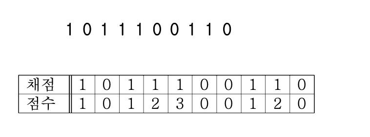
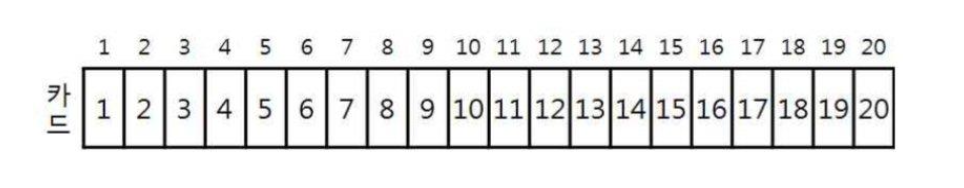
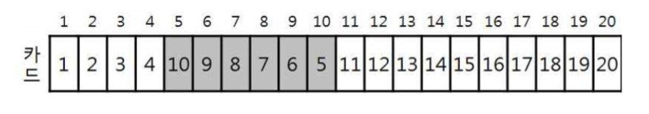
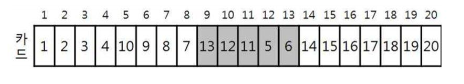
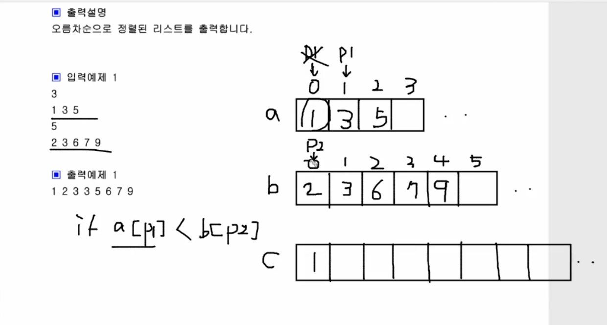

<br/>

---

### 01. K번째 약수

두 개의 자연수 N과 K가 주어졌을 때, N의 약수들 중 K번째로 작은 수를 출력하는 프로그램을 작성하시오.

▣ 입력설명
첫째 줄에 N과 K가 빈칸을 사이에 두고 주어진다. N은 1 이상 10,000 이하이다. K는 1 이상 N 이하이다.

▣ 출력설명
첫째 줄에 N의 약수들 중 K번째로 작은 수를 출력한다. 만일 N의 약수의 개수가 K개보다 적어서 K번째 약수가 존재하지 않을 경우에는 -1을 출력하시오.

▣ 입력예제<br/> 6 3

▣ 출력예제<br/> 3

```python
import sys

n, k=map(int, input().split())
cnt=0
for i in range(1, n+1):
    if n%i==0:
        cnt+=1
    if cnt==k:
        print(i)
        break
else: 
    print(-1)
```
```swift
import Foundation

let input = readLine()!.split(separator: " ").map { Int($0)! }
let (n, k) = (input[0], input[1])

var cnt = 0

for i in 1...n {
    if n % i == 0 {
        cnt += 1
    }
    if cnt == k {
        print(i)
        exit(0) 
    }
}

print(-1)
```

#

### 02. K번째 수

N개의 숫자로 이루어진 숫자열이 주어지면 해당 숫자열중에서 s번째부터 e번째 까지의 수를 오름 차순 정렬했을 때 k번째로 나타나는 숫자를 출력하는 프로그램을 작성하세요.

▣ 입력설명
첫 번째 줄에 테스트 케이스 T(1<=T<=10)이 주어집니다.
각 케이스별
첫 번째 줄은 자연수 N(5<=N<=500), s, e, k가 차례로 주어진다. 두 번째 줄에 N개의 숫자가 차례로 주어진다.

▣ 출력설명
각 케이스별 k번째 수를 아래 출력예제와 같이 출력하세요.

▣ 입력예제<br/>
2<br/>
6 2 5 3<br/>
5 2 7 3 8 9<br/>
15 3 10 3<br/>
4 15 8 16 6 6 17 3 10 11 18 7 14 7 15 <br/>

▣ 출력예제<br/>
#1 7 <br/>
#2 6

```python
import sys

T=int(input())
for t in range(T):
    n, s, e, k=map(int, input().split())
    a=list(map(int, input().split()))
    a=a[s-1:e]
    a.sort()
    print("#%d %d" %(t+1, a[k-1])) 
```
```swift
import Foundation

let T = Int(readLine()!)!

for t in 1...T {
    let inputs = readLine()!.split(separator: " ").map { Int($0)! }
    var (n, s, e, k) = (inputs[0], inputs[1], inputs[2], inputs[3])
    
    var a = readLine()!.split(separator: " ").map { Int($0)! }
    a = Array(a[s-1..<e])
    a.sort()
    
    print("#\(t) \(a[k-1])")
}

```

#

### 03. K번째 큰 수

현수는 1부터 100사이의 자연수가 적힌 N장의 카드를 가지고 있습니다. 같은 숫자의 카드가 여러장 있을 수 있습니다. 현수는 이 중 3장을 뽑아 각 카드에 적힌 수를 합한 값을 기록하려 고 합니다. 3장을 뽑을 수 있는 모든 경우를 기록합니다. 기록한 값 중 K번째로 큰 수를 출력 하는 프로그램을 작성하세요.

만약 큰 수부터 만들어진 수가 25 25 23 23 22 20 19......이고 K값이 3이라면 K번째 큰 값 은 22입니다.

▣ 입력설명
첫 줄에 자연수 N(3<=N<=100)과 K(1<=K<=50) 입력되고, 그 다음 줄에 N개의 카드값이 입력 된다.

▣ 출력설명
첫 줄에 K번째 수를 출력합니다. K번째 수는 반드시 존재합니다.

▣ 입력예제 <br/>
1<br/>
10 3<br/>
13 15 34 23 45 65 33 11 26 42<br/>


▣ 출력예제 <br/>
1 <br/>
143<br/>

```python
import sys

n,k=map(int, input().split())
a=list(map(int, input().split()))
res=set()
for i in range(n):
    for j in range(i+1, n):
        for m in range(j+1, n):
            res.add(a[i]+a[j]+a[m])

res=list(res)
res.sort(reverse=True)
print(res[k-1])
```
```Swift
import Foundation

// Read input
let t = Int(readline()!)!
let nk = readLine()!.split(separator: " ").map { Int($0)! }
let n = nk[0]
let k = nk[1]

let a = readLine()!.split(separator: " ").map { Int($0)! }

var res = Set<Int>()

for i in 0..<n {
    for j in (i+1)..<n {
        for m in (j+1)..<n {
            res.insert(a[i] + a[j] + a[m])
        }
    }
}

let sortedRes = res.sorted(by: >)
print(sortedRes[k-1])
```
#

### (Tip) 최솟값 구하기

```Python
arr = [5, 3, 7, 9, 2, 5, 2, 6]
arrMin = float('inf') #최댓값 할당
for i in range(len(arr)):
    if arr[i]<arrMin:
        arrMin=arr[i]
```
```Swift
let arr = [5, 3, 7, 9, 2, 5, 2, 6]
var arrMin = Int.max  

for i in 0..<arr.count {
    if arr[i] < arrMin {
        arrMin = arr[i]
    }
}
print(arrMin)

//하지만 Swift는 최솟값 함수 찾기가 빌트인으로 선언되어있다
let arr = [5, 3, 7, 9, 2, 5, 2, 6]
if let arrMin = arr.min() {
    print(arrMin)
}
```

#

### 04. 대표값

N명의 학생의 수학점수가 주어집니다. N명의 학생들의 평균(소수 첫째자리 반올림)을 구하고, N명의 학생 중 평균에 가장 가까운 학생은 몇 번째 학생인지 출력하는 프로그램을 작성하세요. <br/>
평균과 가장 가까운 점수가 여러 개일 경우 먼저 점수가 높은 학생의 번호를 답으로 하고, 높은 점수를 가진 학생이 여러 명일 경우 그 중 학생번호가 빠른 학생의 번호를 답으로 합니다. <br/>

▣ 입력설명 <br/>
첫줄에 자연수 N(5<=N<=100)이 주어지고, 두 번째 줄에는 각 학생의 수학점수인 N개의 자연 수가 주어집니다. 학생의 번호는 앞에서부터 1로 시작해서 N까지이다.

▣ 출력설명 <br/>
첫줄에 평균과 평균에 가장 가까운 학생의 번호를 출력한다. 평균은 소수 첫째 자리에서 반올림합니다.

▣ 입력 예제 <br/>
10 <br/>
45 73 66 87 92 67 75 79 75 80 <br/>

▣ 출력 예제 <br/>
1 7 <br/>

```python
import sys

n= int(input())
a=list(map(int, input().split()))

# round()는 반홀림함수 일반적으로 half_up방식 (1.5면 2로 뱉음)
# 파이썬의 roundsms half_even 방식 택함(1.5면 1로 뱉음) 그래서 +0.5
ave=round(sum(a)/n+0.5)
min=21470000000 # 4바이트에서 가장 큰 값

for idx, x in enumerate(a):
    tmp=abs(x-ave) # 절댓값 함수 abs()
    if tmp<min:
        min=tmp
        score=x
        res=idx+1

    #답이 두 개 이상인 경우 점수가 높은 사람 우선순위
    # 점수가 같으면 앞번호 유지
    elif tmp==min:
        if x>score:
            score=x
            res=idx+1

print(ave, res)
```
```Swift
import Foundation

let n = Int(readLine()!)!
let a = readLine()!.split(separator: " ").map { Int($0)! }

//Swift도 파이썬과 마찬가지로 half_evne이기 때문에 0.5를 더해준다
let ave = round(Double(a.reduce(0, +)) / Double(n) + 0.5)
var minDistance = Double(Int.max)
var score = -1
var res = -1

for (idx, x) in a.enumerated() {
    let tmp = abs(Double(x) - ave)
    
    if tmp < minDistance {
        minDistance = tmp
        score = x
        res = idx + 1
    } else if tmp == minDistance {
        if x > score {
            score = x
            res = idx + 1
        }
    }
}

print(Int(ave), res)
```

#

### 05. 정다면체

두 개의 정 N면체와 정 M면체의 두 개의 주사위를 던져서 나올 수 있는 눈의 합 중 가장 확 률이 높은 숫자를 출력하는 프로그램을 작성하세요.<br/>

정답이 여러 개일 경우 오름차순으로 출력합니다.<br/>

▣ 입력설명<br/>
첫 번째 줄에는 자연수 N과 M이 주어집니다. N과 M은 4, 6, 8, 12, 20 중의 하나입니다.<br/>

▣ 출력설명<br/>
첫 번째 줄에 답을 출력합니다.<br/>

▣ 입력예제<br/>
4 6<br/>

▣ 출력예제<br/>
5 6 7<br/>

```python
import sys
n, m=map(int, input().split())

# max값을 이후에 지속적으로 넣어주어야하기 때문에 가장 작은 값 할당
max = -214700000

#눈의 합은 n+m까지 나오겠지만 혹시모르니 +3으로 넉넉하게 잡아주기
cnt=[0]*(n+m+3)

#1부터 n까지 for문 돌리기
for i in range(1, n+1):
    for j in range(1, m+1):
        cnt[i+j]+=1

# +1을 해야 n+m까지 돔
for i in range(n+m+1):
    if cnt[i]>max:
        max=cnt[i]

for i in range(n+m+1):
    if cnt[i]==max:
        print(i, end=' ')
```
```swift
import Foundation

let nm = readLine()!.split(separator: " ").map { Int($0)! }
let (n, m) = (nm[0], nm[1])

// Initialize an array to count occurrences of each sum
var cnt = [Int](repeating: 0, count: n + m + 3)

// Set an initial value for the maximum occurrence
var maxOccurrence = Int.min

// Iterate over all possible dice rolls and count the occurrences of each sum
for i in 1...n {
    for j in 1...m {
        cnt[i + j] += 1
    }
}

// Find the maximum occurrence
for i in 0...(n + m) {
    if cnt[i] > maxOccurrence {
        maxOccurrence = cnt[i]
    }
}

// Print the sums that occurred the maximum number of times
for i in 0...(n + m) {
    if cnt[i] == maxOccurrence {
        print(i, terminator: " ")
    }
}
```
#

### 06. 자릿수의 합

N개의 자연수가 입력되면 각 자연수의 자릿수의 합을 구하고, 그 합이 최대인 자연수를 출력 하는 프로그램을 작성하세요.<br/>
각 자연수의 자릿수의 합을 구하는 함수를 def digit_sum(x)를 꼭 작성해서 프로그래밍 하세요. <br/>

▣ 입력설명<br/>
첫 줄에 자연수의 개수 N(3<=N<=100)이 주어지고, 그 다음 줄에 N개의 자연수가 주어진다. 각 자연수의 크기는 10,000,000를 넘지 않는다.<br/>

▣ 출력설명<br/>
자릿수의 합이 최대인 자연수를 출력한다. 자릿수의 합이 같을 경우 입력순으로 먼저인 숫자 를 출력합니다.<br/>

▣ 입력예제<br/> 
3<br/>
125 15232 97<br/>

▣ 출력예제<br/> 
97<br/>

```python
import sys
n=int(input())
a=list(map(int, input().split()))
max=-214700000

def digit_sum(x):
    sum=0

    # x 각 자릿수 합을 sum에 누적하기
    while x>0:
        sum+=x%10
        x=x//10

for x in a:
    tot=digit_sums(x)
    if tot>max:
        max=tot
        res=x
print(res)


```
```Swift
import Foundation

let n = Int(readLine()!)!
let a = readLine()!.split(separator: " ").map { Int($0)! }

var maxSum = Int.min
var res = 0

func digitSum(_ x: Int) -> Int {
    var sum = 0
    var num = x
    
    while num > 0 {
        sum += num % 10
        num /= 10
    }
    return sum
}

for x in a {
    let tot = digitSum(x)
    if tot > maxSum {
        maxSum = tot
        res = x
    }
}

print(res)
```

#

### 07. 소수(에라토스테네스 체)

자연수 N이 입력되면 1부터 N까지의 소수의 개수를 출력하는 프로그램을 작성하세요.<br/> 
만약 20이 입력되면 1부터 20까지의 소수는 2, 3, 5, 7, 11, 13, 17, 19로 총 8개입니다. 제한시간은 1초입니다.<br/>

▣ 입력설명<br/>
첫 줄에 자연수의 개수 N(2<=N<=200,000)이 주어집니다.<br/>

▣ 출력설명<br/>
첫 줄에 소수의 개수를 출력합니다.<br/>

▣ 입력예제<br/>
20<br/>

▣ 출력예제 <br/>
8 <br/>

```Python
import sys
n=int(input())
ch=[0]*(n+1)
cnt=0

# 소수는 2부터 시작
for i in range(2, n+1):
    if ch[i]==0:
        cnt+=1

        # i부터 시작해서 i씩 n까지 증가
        for j in range(i, n+1, i):
            ch[j]=1

print(cnt)
```
```Swift
import Foundation

let n = Int(readLine()!)!
var ch = [Int](repeating: 0, count: n + 1)
var cnt = 0

for i in 2...n {
    if ch[i] == 0 {
        cnt += 1
        for j in stride(from: i, through: n, by: i) {
            ch[j] = 1
        }
    }
}

print(cnt)
```

#

### 08. 뒤집은 소수

N개의 자연수가 입력되면 각 자연수를 뒤집은 후 그 뒤집은 수가 소수이면 그 수를 출력하는 프로그램을 작성하세요.<br/>
예를 들어 32를 뒤집으면 23이고, 23은 소수이다. 그러면 23을 출력 한다.<br/>
단 910를 뒤집으면 19로 숫자화 해야 한다. 첫 자리부터의 연속된 0은 무시한다.<br/>
뒤집는 함수인 def reverse(x) 와 소수인지를 확인하는 함수 def isPrime(x)를 반드시 작성하 여 프로그래밍 한다.<br/>

▣ 입력설명<br/>
첫 줄에 자연수의 개수 N(3<=N<=100)이 주어지고, 그 다음 줄에 N개의 자연수가 주어진다.<br/>
각 자연수의 크기는 100,000를 넘지 않는다.<br/>

▣ 출력설명<br/>
첫 줄에 뒤집은 소수를 출력합니다. 출력순서는 입력된 순서대로 출력합니다.<br/>

▣ 입력예제<br/>
5<br/>
32 55 62 3700 250<br/>

▣ 출력예제<br/>
23 73 <br/>

```python
import sys
n=int(input())
a=list(map(int, input().split()))

def reverse(x):
    res=0
    while x>0:
        t=x%10
        res=res*10+t
        x=x//10
    return res

def isPrime(x):
    if x==1:
        return False
    for i in range(2, x//2+1): #절반까지만 돌아도 소수 판별 가능
        if x%i==0:
            return False
    else:
        return True    
            

for x in a:
    tmp=reverse(x)
    if isPrime(tmp):
        print(tmp, end=' ')
```
```Swift
import Foundation

let n = Int(readLine()!)!
let a = readLine()!.split(separator: " ").map { Int($0)! }

func reverse(_ x: Int) -> Int {
    var x = x
    var res = 0
    while x > 0 {
        let t = x % 10
        res = res * 10 + t
        x /= 10
    }
    return res
}

func isPrime(_ x: Int) -> Bool {
    if x == 1 {
        return false
    }
    for i in 2...x/2 {
        if x % i == 0 {
            return false
        }
    }
    return true
}

for x in a {
    let tmp = reverse(x)
    if isPrime(tmp) {
        print(tmp, terminator: " ")
    }
}
```

#

### 09. 주사위 게임

1에서부터 6까지의 눈을 가진 3개의 주사위를 던져서 다음과 같은 규칙에 따라 상금을 받는 게 임이 있다.<br/>
규칙(1) 같은 눈이 3개가 나오면 10,000원+(같은 눈)*1,000원의 상금을 받게 된다. <br/>
규칙(2) 같은 눈이 2개만 나오는 경우에는 1,000원+(같은 눈)*100원의 상금을 받게 된다. <br/>
규칙(3) 모두 다른 눈이 나오는 경우에는 (그 중 가장 큰 눈)*100원의 상금을 받게 된다.<br/>
예를 들어, 3개의 눈 3, 3, 6이 주어지면 상금은 1,000+3*100으로 계산되어 1,300원을 받게 된 다. <br/>
또 3개의 눈이 2, 2, 2로 주어지면 10,000+2*1,000 으로 계산되어 12,000원을 받게 된다. <br/>
3개의 눈이 6, 2, 5로 주어지면 그 중 가장 큰 값이 6이므로 6*100으로 계산되어 600원을 상금 으로 받게 된다.<br/>
N 명이 주사위 게임에 참여하였을 때, 가장 많은 상금을 받은 사람의 상금을 출력하는 프로그램 을 작성하시오<br/>

▣ 입력설명<br/>
첫째 줄에는 참여하는 사람 수 N(2<=N<=1,000)이 주어지고 <br/>
그 다음 줄부터 N개의 줄에 사람 들이 주사위를 던진 3개의 눈이 빈칸을 사이에 두고 각각 주어진다.<br/>

▣ 출력설명<br/>
첫째 줄에 가장 많은 상금을 받은 사람의 상금을 출력한다.<br/>

▣ 입력예제<br/>
3<br/>
3 3 6<br/>
2 2 2<br/> 
6 2 5<br/>

▣ 출력예제<br/>
12000<br/>

```python
import sys
n=int(input())
res=0
for i in range(n):
    tmp=input().split()
    tmp=sort()
    a, b, c=map(int, tmp)
    print(a, b, c)

    #if문을 작성할 때는 가장 좁은 범위부터
    if  a==b and b==c:
        money=10000+a*1000
    elif a==b or a==c:
        money=1000+(a*100)
    elif b==c:
        money=1000+(b*100)
    else:
        money=c*100
    if money>res:
        res=money
print(res)
```
```Swift
import Foundation

let n = Int(readLine()!)!
var res = 0

for _ in 0..<n {
    let tmp = readLine()!.split(separator: " ").map { Int($0)! }.sorted()
    let (a, b, c) = (tmp[0], tmp[1], tmp[2])
    
    var money: Int
    if a == b && b == c {
        money = 10000 + a * 1000
    } else if a == b || a == c {
        money = 1000 + a * 100
    } else if b == c {
        money = 1000 + b * 100
    } else {
        money = c * 100
    }
    
    if money > res {
        res = money
    }
}

print(res)
```


#

### 10. 점수계산

OX 문제는 맞거나 틀린 두 경우의 답을 가지는 문제를 말한다. <br/>
여러 개의 OX 문제로 만들어진 시험에서 연속적으로 답을 맞히는 경우에는 가산점을 주기 위해서 다음과 같이 점수 계산을 하기 로 하였다.<br/>
1번 문제가 맞는 경우에는 1점으로 계산한다. 앞의 문제에 대해서는 답을 틀리다가 답이 맞는 처음 문제는 1점으로 계산한다. <br/>
또한, 연속으로 문제의 답이 맞는 경우에서 두 번째 문제는 2점, 세 번째 문제는 3점, ..., K번째 문제는 K점으로 계산한다. <br/>
틀린 문제는 0점으로 계 산한다.<br/>
예를 들어, 아래와 같이 10 개의 OX 문제에서 답이 맞은 문제의 경우에는 1로 표시하고,<br/>
틀린 경 우에는 0으로 표시하였을 때, 점수 계산은 아래 표와 같이 계산되어, <br/>
총 점수는 1+1+2+3+1+2=10 점이다.<br/>

&nbsp;&nbsp;&nbsp;&nbsp;<br/>

시험문제의 채점 결과가 주어졌을 때, 총 점수를 계산하는 프로그램을 작성하시오.<br/>

▣ 입력설명<br/>
첫째 줄에 문제의 개수 N (1 ≤ N ≤ 100)이 주어진다.<br/>
둘째 줄에는 N개 문제의 채점 결과를 나 타내는 0 혹은 1이 빈 칸을 사이에 두고 주어진다.<br/>
0은 문제의 답이 틀린 경우이고, 1은 문제의 답이 맞는 경우이다.<br/>

▣ 출력설명<br/>
첫째 줄에 입력에서 주어진 채점 결과에 대하여 가산점을 고려한 총 점수를 출력한다.<br/>

▣ 입력예제<br/>
10<br/>
1 0 1 1 1 0 0 1 1 0<br/>

▣ 출력예제<br/>
10<br/>

```python
import sys

n=int(input())
a=list(map(int, input().split()))
sum=0
cnt=0
for x in a:
    if x==1:
        cnt+=1
        sum+=cnt
    else:
        cnt=0
print(sum)
```
```swift
import Foundation

let n = Int(readLine()!)!
let a = readLine()!.split(separator: " ").map { Int($0)! }

var sum = 0
var cnt = 0

for x in a {
    if x == 1 {
        cnt += 1
        sum += cnt
    } else {
        cnt = 0
    }
}

print(sum)
```
#

### 11. 회문 문자열 검사

N개의 문자열 데이터를 입력받아 앞에서 읽을 때나 뒤에서 읽을 때나 같은 경우 <br/>
(회문 문자열) 이면 YES를 출력하고 회문 문자열이 아니면 NO를 출력하는 프로그램을 작성한다. <br/>
단 회문을 검사할 때 대소문자를 구분하지 않습니다. <br/>

▣ 입력설명 <br/>
첫 줄에 정수 N(1<=N<=20)이 주어지고, 그 다음 줄부터 N개의 단어가 입력된다.<br/>
각 단어의 길이는 100을 넘지 않는다.<br/>

▣ 출력설명 <br/>
각 줄에 해당 문자열의 결과를 YES 또는 NO로 출력한다. <br/>

▣ 입력예제 <br/>
5 <br/>
level <br/>
moon <br/>
abcba <br/> 
soon <br/> 
gooG <br/>

▣ 출력예제 <br/>
#1 YES <br/>
#2 NO <br/>
#3 YES <br/>
#4 NO <br/>
#5 YES <br/>

```python
import sys

n=int(input())
for i in range(n):
    s=input()
    s=s.upper()
    size=len(s[-1])

    for j in range(size//2):
        if s[j]!=s[-1-j]:
            print("#%d NO" %(i+1))
            break
    else:
        print("#%d YES" %(i+1))
```
```swift
import Foundation

let n = Int(readLine()!)!
for i in 1...n {
    let s = readLine()!.uppercased()
    let reversedS = String(s.reversed())
    
    if s == reversedS {
        print("#\(i) YES")
    } else {
        print("#\(i) NO")
    }
}
```

#

### 12. 숫자만 추출

문자와 숫자가 섞여있는 문자열이 주어지면 그 중 숫자만 추출하여 그 순서대로 자연수를 만 듭니다.<br/>
만들어진 자연수와 그 자연수의 약수 개수를 출력합니다.<br/>
만약 “t0e0a1c2h0er”에서 숫자만 추출하면 0, 0, 1, 2, 0이고 이것을 자연수를 만들면 120이 됩니다.<br/>
즉첫자리0은자연수화할때무시합니다. 출력은 120를출력하고,다음줄에 120 의 약수의 개수를 출력하면 됩니다.<br/>
추출하여 만들어지는 자연수는 100,000,000을 넘지 않습니다.<br/>

▣ 입력설명<br/>
첫 줄에 숫자가 썩인 문자열이 주어집니다.<br/>
문자열의 길이는 50을 넘지 않습니다.<br/>

▣ 출력설명<br/>
첫 줄에 자연수를 출력하고, 두 번째 줄에 약수의 개수를 출력합니다.<br/>

▣ 입력예제<br/>
g0en2Ts8eSoft<br/>

▣ 출력예제<br/>
28<br/>
6<br/>

```python
import sys
s=input()
res=0

for x in s:
    if x.isDecimal():
        res=res*10+int(x)
print(res)
cnt = 0
for i in range(1, res+1):
    if res%i==0:
        cnt+=1
print(cnt)
```
```Swift
import Foundation

let s = readLine()!
var res = 0

for char in s {
    if let num = Int(String(char)) {
        res = res * 10 + num
    }
}

print(res)

var cnt = 0
for i in 1...res {
    if res % i == 0 {
        cnt += 1
    }
}

print(cnt)
```

#

### 13. 카드 역배치

1부터 20까지 숫자가 하나씩 쓰인 20장의 카드가 아래 그림과 같이 오름차순으로 한 줄로 놓 여있다. <br/>
각 카드의 위치는 카드 위에 적힌 숫자와 같이 1부터 20까지로 나타낸다. <br/>

&nbsp;&nbsp;&nbsp;&nbsp;<br/>

이제 여러분은 다음과 같은 규칙으로 카드의 위치를 바꾼다: <br/>
구간 [a, b] (단, 1 ≤ a ≤ b ≤ 20)가 주어지면 위치 a부터 위치 b까지의 카드를 현재의 역순으로 놓는다. <br/>
예를 들어, 현재 카드가 놓인 순서가 위의 그림과 같고 구간이 [5, 10]으로 주어진다면, <br/>
위치 5부터 위치 10까지의 카드 5, 6, 7, 8, 9, 10을 역순으로 하여 10, 9, 8, 7, 6, 5로 놓는다. <br/>
이제 전체 카드가 놓인 순서는 아래 그림과 같다.<br/>

&nbsp;&nbsp;&nbsp;&nbsp;<br/>

이 상태에서 구간 [9, 13]이 다시 주어진다면, 위치 9부터 위치 13까지의 카드 6, 5, 11, 12, 13을 역순으로 하여 <br/>
13, 12, 11, 5, 6으로 놓는다. 이제 전체 카드가 놓인 순서는 아래 그림 과 같다. <br/>

&nbsp;&nbsp;&nbsp;&nbsp;<br/>

오름차순으로 한 줄로 놓여있는 20장의 카드에 대해 10개의 구간이 주어지면, <br/>
주어진 구간의 순서대로 위의 규칙에 따라 순서를 뒤집는 작업을 연속해서 처리한 뒤 <br/>
마지막 카드들의 배치 를 구하는 프로그램을 작성하시오. <br/>

▣ 입력설명 <br/>
총 10개의 줄에 걸쳐 한 줄에 하나씩 10개의 구간이 주어진다. <br/>
i번째 줄에는 i번째 구간의 시 작 위치 ai와 끝 위치 bi가 차례대로 주어진다.<br/>
이때 두 값의 범위는 1 ≤ ai ≤ bi ≤ 20이다. <br/>

▣ 출력설명 <br/>
1부터 20까지 오름차순으로 놓인 카드들에 대해, <br/>
입력으로 주어진 10개의 구간 순서대로 뒤집 는 작업을 했을 때 마지막 카드들의 배치를 한 줄에 출력한다. <br/>

▣ 입력예제 
5 10 <br/>
9 13 <br/>
1 2 <br/>
3 4 <br/>
5 6 <br/>
1 2 <br/>
3 4 <br/>
5 6 <br/> 
1 20 <br/>
1 20 <br/>

▣ 출력예제 <br/>
1 2 3 4 10 9 8 7 13 12 11 5 6 14 15 16 17 18 19 20 <br/>

```python
import sys

a=list(range(21))
for _ in range(10):
    s, e=map(int, input().split())
    for i in range((e-s+1)//2):
        a[s+i], a[e-i]=a[e-i], a[s+i]

a.pop(0)
for x in a:
    print(x, end= ' ')
print(a)
```
```Swift
var cards = Array(0...20)  

for _ in 0..<10 {
    let range = readLine()!.split(separator: " ").map { Int($0)! }
    let (start, end) = (range[0], range[1])
    
    var i = 0
    while i < (end - start + 1) / 2 {
        cards.swapAt(start + i, end - i)
        i += 1
    }
}

cards.remove(at: 0) 
for card in cards {
    print(card, terminator: " ")
}
print()
```

#

### 14. 두 리스트 합치기

오름차순으로 정렬이 된 두 리스트가 주어지면 두 리스트를 오름차순으로 합쳐 출력하는 프로 그램을 작성하세요. <br/>

▣ 입력설명 <br/>
첫 번째 줄에 첫 번째 리스트의 크기 N(1<=N<=100)이 주어집니다. <br/>
두 번째 줄에 N개의 리스트 원소가 오름차순으로 주어집니다. <br/>
세 번째 줄에 두 번째 리스트의 크기 M(1<=M<=100)이 주어집니다.  <br/>
네 번째 줄에 M개의 리스트 원소가 오름차순으로 주어집니다. <br/>
각 리스트의 원소는 int형 변수의 크기를 넘지 않습니다. <br/>
(sort함수를 사용하는 것보다 시간복잡도를 더 줄일 것) <br/>

▣ 출력설명 <br/>
오름차순으로 정렬된 리스트를 출력합니다. <br/>

▣ 입력예제 <br/>
3 <br/>
1 3 5 <br/>
5 <br/>
2 3 6 7 9 <br/>

▣ 출력예제 <br/>
1 2 3 3 5 6 7 9 <br/>

&nbsp;&nbsp;&nbsp;&nbsp;<br/>


```python
import sys

n=int(input())
a=list(map(int, input().split()))
m=int(input())
b=list(map(int, input().split()))
p1=p2=0
c=[]
while p1<n and p2<m:
    if a[p1]<=b[p2]:
        c.append(a[p1])
        p1+=1
    else:
        c.append(b[p2])
        p2+=1
if p1<n:
    c=c+a[p1:]
if p2<m:
    c=c+b[p2:]

for x in c:
    print(x, end=' ')
```
```Swift
import Foundation

let n = Int(readLine()!)!
let a = readLine()!.split(separator: " ").map { Int($0)! }

let m = Int(readLine()!)!
let b = readLine()!.split(separator: " ").map { Int($0)! }

var p1 = 0
var p2 = 0
var c: [Int] = []

while p1 < n && p2 < m {
    if a[p1] <= b[p2] {
        c.append(a[p1])
        p1 += 1
    } else {
        c.append(b[p2])
        p2 += 1
    }
}

if p1 < n {
    c += a[p1...]
}

if p2 < m {
    c += b[p2...]
}

for x in c {
    print(x, terminator: " ")
}
```


