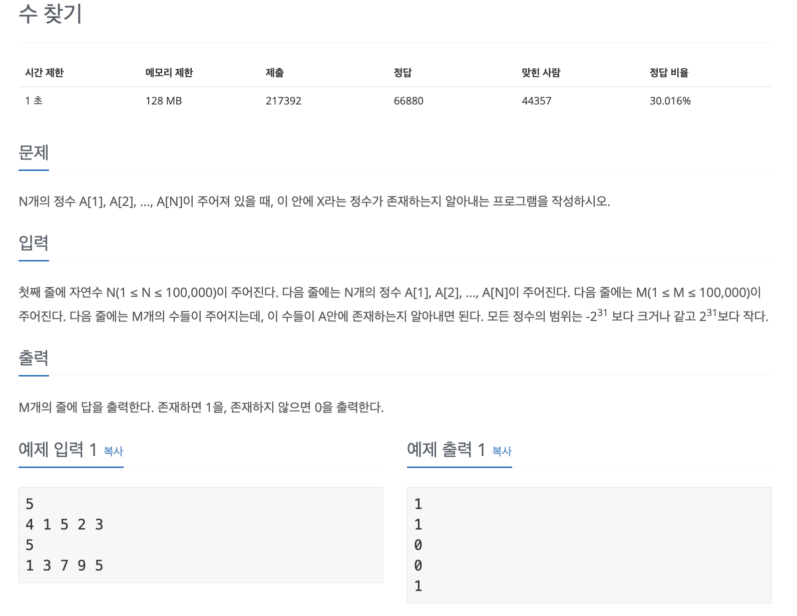

# ProblemSolving100


<br/>

---

### 04. [백준 1920] 수찾기


&nbsp;&nbsp;&nbsp;&nbsp;<br/>


```dart
import 'dart:io';

void main() {
  stdin.readLineSync(); // Discard the first line

  List<int> inputList = stdin.readLineSync()!.split(" ").map((str) => int.parse(str)).toList();
  stdin.readLineSync(); // Discard the third line

  List<int> checkList = stdin.readLineSync()!.split(" ").map((str) => int.parse(str)).toList();
  List<int> answerList = []; // This will hold your answers

  for (int checkValue in checkList) {
    if (inputList.contains(checkValue)) {
      answerList.add(1); // If the value is in the list, add 1 to the answerList
    } else {
      answerList.add(0); // If the value is not in the list, add 0 to the answerList
    }
  }

  // Output the answerList
  for (int answer in answerList) {
    print(answer);
  }
}
```

```swift
import Foundation

_ = readLine()
let inputList = readLine()!.split(separator: " ").map { Int(String($0))! }
_ = readLine()
let checkList = readLine()!.split(separator: " ").map { Int(String($0))! }

var answerList: [Int] = []


for checkValue in checkList {
    if inputList.contains(checkValue) {
        answerList.append(1)
    } else {
        answerList.append(0)
    }
}

for answer in answerList {
    print(answer)
}
```
- 나의 풀이 로직 <br/>
1. 2,4번째 입력값을 받을 배열과 정답 배열 객체를 만들어준다
2. 체크리스트를 for-in 반복을 돌려 값하나씩 체크하고 true면 정답배열에 1, false면 정답배열에 0을 담는다.
3. 정답배열을 for-in문을 돌려 출력한다

<br/>

- 결과: 시간 초과가 뜬다. `contain()`의 시간복잡도가 n이기 때문에 for문안에서 돌아 최종적인 시간복잡도는 O(n^2)이 되어버린다
1. 비교할 배열을 Set으로 답안을 다시 풀어보기 (Set은 비교할 때 시간복잡도가 O(1)이기 때문에)
```dart
import 'dart:io';

void main() {
  Set<int> inputSet = stdin.readLineSync()!.split(' ').map(int.parse).toSet();
  List<int> checkList = stdin.readLineSync()!.split(' ').map(int.parse).toList();

  for (int checkValue in checkList) {
    if (inputSet.contains(checkValue)) {
      print(1); // If the value is in the set, print 1
    } else {
      print(0); // If the value is not in the set, print 0
    }
  }
}

```
```swift
import Foundation

let n = Int(readLine()!)!

let array = Set(readLine()!.split(separator: " ").map { Int($0)! })

let m = Int(readLine()!)!

let x_values = readLine()!.split(separator: " ").map { Int($0)! }

for x in x_values {
    print(array.contains(x) ? 1 : 0)
}
```
   
