<br/>

---

### 01. K번째 약수

두 개의 자연수 N과 K가 주어졌을 때, N의 약수들 중 K번째로 작은 수를 출력하는 프로그램을 작성하시오.

▣ 입력설명
첫째 줄에 N과 K가 빈칸을 사이에 두고 주어진다. N은 1 이상 10,000 이하이다. K는 1 이상 N 이하이다.

▣ 출력설명
첫째 줄에 N의 약수들 중 K번째로 작은 수를 출력한다. 만일 N의 약수의 개수가 K개보다 적어서 K번째 약수가 존재하지 않을 경우에는 -1을 출력하시오.

▣ 입력예제<br/> 6 3

▣ 출력예제<br/> 3

```swift
import Foundation

let input = readLine()!.split(separator: " ").map { Int($0)! }
let (n, k) = (input[0], input[1])

var cnt = 0

for i in 1...n {
    if n % i == 0 {
        cnt += 1
    }
    if cnt == k {
        print(i)
        exit(0) 
    }
}

print(-1)
```

#

### 02. K번째 수

N개의 숫자로 이루어진 숫자열이 주어지면 해당 숫자열중에서 s번째부터 e번째 까지의 수를 오름 차순 정렬했을 때 k번째로 나타나는 숫자를 출력하는 프로그램을 작성하세요.

▣ 입력설명
첫 번째 줄에 테스트 케이스 T(1<=T<=10)이 주어집니다.
각 케이스별
첫 번째 줄은 자연수 N(5<=N<=500), s, e, k가 차례로 주어진다. 두 번째 줄에 N개의 숫자가 차례로 주어진다.

▣ 출력설명
각 케이스별 k번째 수를 아래 출력예제와 같이 출력하세요.

▣ 입력예제<br/>
2<br/>
6 2 5 3<br/>
5 2 7 3 8 9<br/>
15 3 10 3<br/>
4 15 8 16 6 6 17 3 10 11 18 7 14 7 15 <br/>

▣ 출력예제<br/>
#1 7 <br/>
#2 6

```swift
import Foundation

let T = Int(readLine()!)!

for t in 1...T {
    let inputs = readLine()!.split(separator: " ").map { Int($0)! }
    var (n, s, e, k) = (inputs[0], inputs[1], inputs[2], inputs[3])
    
    var a = readLine()!.split(separator: " ").map { Int($0)! }
    a = Array(a[s-1..<e])
    a.sort()
    
    print("#\(t) \(a[k-1])")
}

```

#

### 03. K번째 큰 수

현수는 1부터 100사이의 자연수가 적힌 N장의 카드를 가지고 있습니다. 같은 숫자의 카드가 여러장 있을 수 있습니다. 현수는 이 중 3장을 뽑아 각 카드에 적힌 수를 합한 값을 기록하려 고 합니다. 3장을 뽑을 수 있는 모든 경우를 기록합니다. 기록한 값 중 K번째로 큰 수를 출력 하는 프로그램을 작성하세요.

만약 큰 수부터 만들어진 수가 25 25 23 23 22 20 19......이고 K값이 3이라면 K번째 큰 값 은 22입니다.

▣ 입력설명
첫 줄에 자연수 N(3<=N<=100)과 K(1<=K<=50) 입력되고, 그 다음 줄에 N개의 카드값이 입력 된다.

▣ 출력설명
첫 줄에 K번째 수를 출력합니다. K번째 수는 반드시 존재합니다.

▣ 입력예제 <br/>
1<br/>
10 3<br/>
13 15 34 23 45 65 33 11 26 42<br/>


▣ 출력예제 <br/>
1 <br/>
143<br/>

```Swift
import Foundation

// Read input
let t = Int(readline()!)!
let nk = readLine()!.split(separator: " ").map { Int($0)! }
let n = nk[0]
let k = nk[1]

let a = readLine()!.split(separator: " ").map { Int($0)! }

var res = Set<Int>()

for i in 0..<n {
    for j in (i+1)..<n {
        for m in (j+1)..<n {
            res.insert(a[i] + a[j] + a[m])
        }
    }
}

let sortedRes = res.sorted(by: >)
print(sortedRes[k-1])
```
#

### (Tip) 최솟값 구하기

```Swift
let arr = [5, 3, 7, 9, 2, 5, 2, 6]
var arrMin = Int.max  

for i in 0..<arr.count {
    if arr[i] < arrMin {
        arrMin = arr[i]
    }
}
print(arrMin)

//하지만 Swift는 최솟값 함수 찾기가 빌트인으로 선언되어있다
let arr = [5, 3, 7, 9, 2, 5, 2, 6]
if let arrMin = arr.min() {
    print(arrMin)
}
```

#

### 04. 대표값

N명의 학생의 수학점수가 주어집니다. N명의 학생들의 평균(소수 첫째자리 반올림)을 구하고, N명의 학생 중 평균에 가장 가까운 학생은 몇 번째 학생인지 출력하는 프로그램을 작성하세요. <br/>
평균과 가장 가까운 점수가 여러 개일 경우 먼저 점수가 높은 학생의 번호를 답으로 하고, 높은 점수를 가진 학생이 여러 명일 경우 그 중 학생번호가 빠른 학생의 번호를 답으로 합니다. <br/>

▣ 입력설명 <br/>
첫줄에 자연수 N(5<=N<=100)이 주어지고, 두 번째 줄에는 각 학생의 수학점수인 N개의 자연 수가 주어집니다. 학생의 번호는 앞에서부터 1로 시작해서 N까지이다.

▣ 출력설명 <br/>
첫줄에 평균과 평균에 가장 가까운 학생의 번호를 출력한다. 평균은 소수 첫째 자리에서 반올림합니다.

▣ 입력 예제 <br/>
10 <br/>
45 73 66 87 92 67 75 79 75 80 <br/>

▣ 출력 예제 <br/>
1 7 <br/>

```Swift
import Foundation

let n = Int(readLine()!)!
let a = readLine()!.split(separator: " ").map { Int($0)! }

//Swift도 파이썬과 마찬가지로 half_even이기 때문에 0.1을 더해준다
let ave = round(Double(a.reduce(0, +)) / Double(n) + 0.1)
var minDistance = Double(Int.max)
var score = -1
var res = -1

for (idx, x) in a.enumerated() {
    let tmp = abs(Double(x) - ave)
    
    if tmp < minDistance {
        minDistance = tmp
        score = x
        res = idx + 1
    } else if tmp == minDistance {
        if x > score {
            score = x
            res = idx + 1
        }
    }
}

print(Int(ave), res)
```

#

### 05. 정다면체

두 개의 정 N면체와 정 M면체의 두 개의 주사위를 던져서 나올 수 있는 눈의 합 중 가장 확 률이 높은 숫자를 출력하는 프로그램을 작성하세요.<br/>

정답이 여러 개일 경우 오름차순으로 출력합니다.<br/>

▣ 입력설명<br/>
첫 번째 줄에는 자연수 N과 M이 주어집니다. N과 M은 4, 6, 8, 12, 20 중의 하나입니다.<br/>

▣ 출력설명<br/>
첫 번째 줄에 답을 출력합니다.<br/>

▣ 입력예제<br/>
4 6<br/>

▣ 출력예제<br/>
5 6 7<br/>

```swift
import Foundation

let nm = readLine()!.split(separator: " ").map { Int($0)! }
let (n, m) = (nm[0], nm[1])

// Initialize an array to count occurrences of each sum
var cnt = [Int](repeating: 0, count: n + m + 3)

// Set an initial value for the maximum occurrence
var maxOccurrence = Int.min

// Iterate over all possible dice rolls and count the occurrences of each sum
for i in 1...n {
    for j in 1...m {
        cnt[i + j] += 1
    }
}

// Find the maximum occurrence
for i in 0...(n + m) {
    if cnt[i] > maxOccurrence {
        maxOccurrence = cnt[i]
    }
}

// Print the sums that occurred the maximum number of times
for i in 0...(n + m) {
    if cnt[i] == maxOccurrence {
        print(i, terminator: " ")
    }
}
```
#

### 06. 자릿수의 합

N개의 자연수가 입력되면 각 자연수의 자릿수의 합을 구하고, 그 합이 최대인 자연수를 출력 하는 프로그램을 작성하세요.<br/>
각 자연수의 자릿수의 합을 구하는 함수를 def digit_sum(x)를 꼭 작성해서 프로그래밍 하세요. <br/>

▣ 입력설명<br/>
첫 줄에 자연수의 개수 N(3<=N<=100)이 주어지고, 그 다음 줄에 N개의 자연수가 주어진다. 각 자연수의 크기는 10,000,000를 넘지 않는다.<br/>

▣ 출력설명<br/>
자릿수의 합이 최대인 자연수를 출력한다. 자릿수의 합이 같을 경우 입력순으로 먼저인 숫자 를 출력합니다.<br/>

▣ 입력예제<br/> 
3<br/>
125 15232 97<br/>

▣ 출력예제<br/> 
97<br/>

```Swift
import Foundation

let n = Int(readLine()!)!
let a = readLine()!.split(separator: " ").map { Int($0)! }

var maxSum = Int.min
var res = 0

func digitSum(_ x: Int) -> Int {
    var sum = 0
    var num = x
    
    while num > 0 {
        sum += num % 10
        num /= 10
    }
    return sum
}

for x in a {
    let tot = digitSum(x)
    if tot > maxSum {
        maxSum = tot
        res = x
    }
}

print(res)
```

#

### 07. 소수(에라토스테네스 체)

자연수 N이 입력되면 1부터 N까지의 소수의 개수를 출력하는 프로그램을 작성하세요.<br/> 
만약 20이 입력되면 1부터 20까지의 소수는 2, 3, 5, 7, 11, 13, 17, 19로 총 8개입니다. 제한시간은 1초입니다.<br/>

▣ 입력설명<br/>
첫 줄에 자연수의 개수 N(2<=N<=200,000)이 주어집니다.<br/>

▣ 출력설명<br/>
첫 줄에 소수의 개수를 출력합니다.<br/>

▣ 입력예제<br/>
20<br/>

▣ 출력예제 <br/>
8 <br/>


```Swift
import Foundation

let n = Int(readLine()!)!
var ch = [Int](repeating: 0, count: n + 1)
var cnt = 0

for i in 2...n {
    if ch[i] == 0 {
        cnt += 1
        for j in stride(from: i, through: n, by: i) {
            ch[j] = 1
        }
    }
}

print(cnt)
```

#

### 08. 뒤집은 소수

N개의 자연수가 입력되면 각 자연수를 뒤집은 후 그 뒤집은 수가 소수이면 그 수를 출력하는 프로그램을 작성하세요.<br/>
예를 들어 32를 뒤집으면 23이고, 23은 소수이다. 그러면 23을 출력 한다.<br/>
단 910를 뒤집으면 19로 숫자화 해야 한다. 첫 자리부터의 연속된 0은 무시한다.<br/>
뒤집는 함수인 def reverse(x) 와 소수인지를 확인하는 함수 def isPrime(x)를 반드시 작성하 여 프로그래밍 한다.<br/>

▣ 입력설명<br/>
첫 줄에 자연수의 개수 N(3<=N<=100)이 주어지고, 그 다음 줄에 N개의 자연수가 주어진다.<br/>
각 자연수의 크기는 100,000를 넘지 않는다.<br/>

▣ 출력설명<br/>
첫 줄에 뒤집은 소수를 출력합니다. 출력순서는 입력된 순서대로 출력합니다.<br/>

▣ 입력예제<br/>
5<br/>
32 55 62 3700 250<br/>

▣ 출력예제<br/>
23 73 <br/>

```Swift
import Foundation

let n = Int(readLine()!)!
let a = readLine()!.split(separator: " ").map { Int($0)! }

func reverse(_ x: Int) -> Int {
    var x = x
    var res = 0
    while x > 0 {
        let t = x % 10
        res = res * 10 + t
        x /= 10
    }
    return res
}

func isPrime(_ x: Int) -> Bool {
    if x == 1 {
        return false
    }
    for i in 2...x/2 {
        if x % i == 0 {
            return false
        }
    }
    return true
}

for x in a {
    let tmp = reverse(x)
    if isPrime(tmp) {
        print(tmp, terminator: " ")
    }
}
```

#

### 09. 주사위 게임

1에서부터 6까지의 눈을 가진 3개의 주사위를 던져서 다음과 같은 규칙에 따라 상금을 받는 게 임이 있다.<br/>
규칙(1) 같은 눈이 3개가 나오면 10,000원+(같은 눈)*1,000원의 상금을 받게 된다. <br/>
규칙(2) 같은 눈이 2개만 나오는 경우에는 1,000원+(같은 눈)*100원의 상금을 받게 된다. <br/>
규칙(3) 모두 다른 눈이 나오는 경우에는 (그 중 가장 큰 눈)*100원의 상금을 받게 된다.<br/>
예를 들어, 3개의 눈 3, 3, 6이 주어지면 상금은 1,000+3*100으로 계산되어 1,300원을 받게 된 다. <br/>
또 3개의 눈이 2, 2, 2로 주어지면 10,000+2*1,000 으로 계산되어 12,000원을 받게 된다. <br/>
3개의 눈이 6, 2, 5로 주어지면 그 중 가장 큰 값이 6이므로 6*100으로 계산되어 600원을 상금 으로 받게 된다.<br/>
N 명이 주사위 게임에 참여하였을 때, 가장 많은 상금을 받은 사람의 상금을 출력하는 프로그램 을 작성하시오<br/>

▣ 입력설명<br/>
첫째 줄에는 참여하는 사람 수 N(2<=N<=1,000)이 주어지고 <br/>
그 다음 줄부터 N개의 줄에 사람 들이 주사위를 던진 3개의 눈이 빈칸을 사이에 두고 각각 주어진다.<br/>

▣ 출력설명<br/>
첫째 줄에 가장 많은 상금을 받은 사람의 상금을 출력한다.<br/>

▣ 입력예제<br/>
3<br/>
3 3 6<br/>
2 2 2<br/> 
6 2 5<br/>

▣ 출력예제<br/>
12000<br/>

```Swift
import Foundation

let n = Int(readLine()!)!
var res = 0

for _ in 0..<n {
    let tmp = readLine()!.split(separator: " ").map { Int($0)! }.sorted()
    let (a, b, c) = (tmp[0], tmp[1], tmp[2])
    
    var money: Int
    if a == b && b == c {
        money = 10000 + a * 1000
    } else if a == b || a == c {
        money = 1000 + a * 100
    } else if b == c {
        money = 1000 + b * 100
    } else {
        money = c * 100
    }
    
    if money > res {
        res = money
    }
}

print(res)
```


#

### 10. 점수계산

OX 문제는 맞거나 틀린 두 경우의 답을 가지는 문제를 말한다. <br/>
여러 개의 OX 문제로 만들어진 시험에서 연속적으로 답을 맞히는 경우에는 가산점을 주기 위해서 다음과 같이 점수 계산을 하기 로 하였다.<br/>
1번 문제가 맞는 경우에는 1점으로 계산한다. 앞의 문제에 대해서는 답을 틀리다가 답이 맞는 처음 문제는 1점으로 계산한다. <br/>
또한, 연속으로 문제의 답이 맞는 경우에서 두 번째 문제는 2점, 세 번째 문제는 3점, ..., K번째 문제는 K점으로 계산한다. <br/>
틀린 문제는 0점으로 계 산한다.<br/>
예를 들어, 아래와 같이 10 개의 OX 문제에서 답이 맞은 문제의 경우에는 1로 표시하고,<br/>
틀린 경 우에는 0으로 표시하였을 때, 점수 계산은 아래 표와 같이 계산되어, <br/>
총 점수는 1+1+2+3+1+2=10 점이다.<br/>

&nbsp;&nbsp;&nbsp;&nbsp;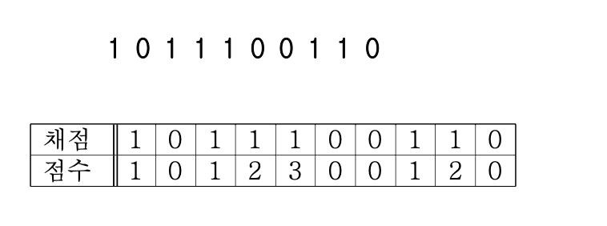<br/>

시험문제의 채점 결과가 주어졌을 때, 총 점수를 계산하는 프로그램을 작성하시오.<br/>

▣ 입력설명<br/>
첫째 줄에 문제의 개수 N (1 ≤ N ≤ 100)이 주어진다.<br/>
둘째 줄에는 N개 문제의 채점 결과를 나 타내는 0 혹은 1이 빈 칸을 사이에 두고 주어진다.<br/>
0은 문제의 답이 틀린 경우이고, 1은 문제의 답이 맞는 경우이다.<br/>

▣ 출력설명<br/>
첫째 줄에 입력에서 주어진 채점 결과에 대하여 가산점을 고려한 총 점수를 출력한다.<br/>

▣ 입력예제<br/>
10<br/>
1 0 1 1 1 0 0 1 1 0<br/>

▣ 출력예제<br/>
10<br/>

```swift
import Foundation

let n = Int(readLine()!)!
let a = readLine()!.split(separator: " ").map { Int($0)! }

var sum = 0
var cnt = 0

for x in a {
    if x == 1 {
        cnt += 1
        sum += cnt
    } else {
        cnt = 0
    }
}

print(sum)
```
#

### 11. 회문 문자열 검사

N개의 문자열 데이터를 입력받아 앞에서 읽을 때나 뒤에서 읽을 때나 같은 경우 <br/>
(회문 문자열) 이면 YES를 출력하고 회문 문자열이 아니면 NO를 출력하는 프로그램을 작성한다. <br/>
단 회문을 검사할 때 대소문자를 구분하지 않습니다. <br/>

▣ 입력설명 <br/>
첫 줄에 정수 N(1<=N<=20)이 주어지고, 그 다음 줄부터 N개의 단어가 입력된다.<br/>
각 단어의 길이는 100을 넘지 않는다.<br/>

▣ 출력설명 <br/>
각 줄에 해당 문자열의 결과를 YES 또는 NO로 출력한다. <br/>

▣ 입력예제 <br/>
5 <br/>
level <br/>
moon <br/>
abcba <br/> 
soon <br/> 
gooG <br/>

▣ 출력예제 <br/>
#1 YES <br/>
#2 NO <br/>
#3 YES <br/>
#4 NO <br/>
#5 YES <br/>


```swift
import Foundation

let n = Int(readLine()!)!
for i in 1...n {
    let s = readLine()!.uppercased()
    let reversedS = String(s.reversed())
    
    if s == reversedS {
        print("#\(i) YES")
    } else {
        print("#\(i) NO")
    }
}
```

#

### 12. 숫자만 추출

문자와 숫자가 섞여있는 문자열이 주어지면 그 중 숫자만 추출하여 그 순서대로 자연수를 만 듭니다.<br/>
만들어진 자연수와 그 자연수의 약수 개수를 출력합니다.<br/>
만약 “t0e0a1c2h0er”에서 숫자만 추출하면 0, 0, 1, 2, 0이고 이것을 자연수를 만들면 120이 됩니다.<br/>
즉첫자리0은자연수화할때무시합니다. 출력은 120를출력하고,다음줄에 120 의 약수의 개수를 출력하면 됩니다.<br/>
추출하여 만들어지는 자연수는 100,000,000을 넘지 않습니다.<br/>

▣ 입력설명<br/>
첫 줄에 숫자가 썩인 문자열이 주어집니다.<br/>
문자열의 길이는 50을 넘지 않습니다.<br/>

▣ 출력설명<br/>
첫 줄에 자연수를 출력하고, 두 번째 줄에 약수의 개수를 출력합니다.<br/>

▣ 입력예제<br/>
g0en2Ts8eSoft<br/>

▣ 출력예제<br/>
28<br/>
6<br/>

```Swift
import Foundation

let s = readLine()!
var res = 0

for char in s {
    if let num = Int(String(char)) {
        res = res * 10 + num
    }
}

print(res)

var cnt = 0
for i in 1...res {
    if res % i == 0 {
        cnt += 1
    }
}

print(cnt)
```

#

### 13. 카드 역배치

1부터 20까지 숫자가 하나씩 쓰인 20장의 카드가 아래 그림과 같이 오름차순으로 한 줄로 놓 여있다. <br/>
각 카드의 위치는 카드 위에 적힌 숫자와 같이 1부터 20까지로 나타낸다. <br/>

&nbsp;&nbsp;&nbsp;&nbsp;<br/>

이제 여러분은 다음과 같은 규칙으로 카드의 위치를 바꾼다: <br/>
구간 [a, b] (단, 1 ≤ a ≤ b ≤ 20)가 주어지면 위치 a부터 위치 b까지의 카드를 현재의 역순으로 놓는다. <br/>
예를 들어, 현재 카드가 놓인 순서가 위의 그림과 같고 구간이 [5, 10]으로 주어진다면, <br/>
위치 5부터 위치 10까지의 카드 5, 6, 7, 8, 9, 10을 역순으로 하여 10, 9, 8, 7, 6, 5로 놓는다. <br/>
이제 전체 카드가 놓인 순서는 아래 그림과 같다.<br/>

&nbsp;&nbsp;&nbsp;&nbsp;<br/>

이 상태에서 구간 [9, 13]이 다시 주어진다면, 위치 9부터 위치 13까지의 카드 6, 5, 11, 12, 13을 역순으로 하여 <br/>
13, 12, 11, 5, 6으로 놓는다. 이제 전체 카드가 놓인 순서는 아래 그림 과 같다. <br/>

&nbsp;&nbsp;&nbsp;&nbsp;<br/>

오름차순으로 한 줄로 놓여있는 20장의 카드에 대해 10개의 구간이 주어지면, <br/>
주어진 구간의 순서대로 위의 규칙에 따라 순서를 뒤집는 작업을 연속해서 처리한 뒤 <br/>
마지막 카드들의 배치 를 구하는 프로그램을 작성하시오. <br/>

▣ 입력설명 <br/>
총 10개의 줄에 걸쳐 한 줄에 하나씩 10개의 구간이 주어진다. <br/>
i번째 줄에는 i번째 구간의 시 작 위치 ai와 끝 위치 bi가 차례대로 주어진다.<br/>
이때 두 값의 범위는 1 ≤ ai ≤ bi ≤ 20이다. <br/>

▣ 출력설명 <br/>
1부터 20까지 오름차순으로 놓인 카드들에 대해, <br/>
입력으로 주어진 10개의 구간 순서대로 뒤집 는 작업을 했을 때 마지막 카드들의 배치를 한 줄에 출력한다. <br/>

▣ 입력예제 <br/>
5 10 <br/>
9 13 <br/>
1 2 <br/>
3 4 <br/>
5 6 <br/>
1 2 <br/>
3 4 <br/>
5 6 <br/> 
1 20 <br/>
1 20 <br/>

▣ 출력예제 <br/>
1 2 3 4 10 9 8 7 13 12 11 5 6 14 15 16 17 18 19 20 <br/>

```Swift
import Foundation

var cards = Array(0...20)  

for _ in 0..<10 {
    let range = readLine()!.split(separator: " ").map { Int($0)! }
    let (start, end) = (range[0], range[1])
    
    var i = 0
    while i < (end - start + 1) / 2 {
        cards.swapAt(start + i, end - i)
        i += 1
    }
}

cards.remove(at: 0)
for card in cards {
    print(card, terminator: " ")
}
```

#

### 14. 두 리스트 합치기

오름차순으로 정렬이 된 두 리스트가 주어지면 두 리스트를 오름차순으로 합쳐 출력하는 프로 그램을 작성하세요. <br/>

▣ 입력설명 <br/>
첫 번째 줄에 첫 번째 리스트의 크기 N(1<=N<=100)이 주어집니다. <br/>
두 번째 줄에 N개의 리스트 원소가 오름차순으로 주어집니다. <br/>
세 번째 줄에 두 번째 리스트의 크기 M(1<=M<=100)이 주어집니다.  <br/>
네 번째 줄에 M개의 리스트 원소가 오름차순으로 주어집니다. <br/>
각 리스트의 원소는 int형 변수의 크기를 넘지 않습니다. <br/>
(sort함수를 사용하는 것보다 시간복잡도를 더 줄일 것) <br/>

▣ 출력설명 <br/>
오름차순으로 정렬된 리스트를 출력합니다. <br/>

▣ 입력예제 <br/>
3 <br/>
1 3 5 <br/>
5 <br/>
2 3 6 7 9 <br/>

▣ 출력예제 <br/>
1 2 3 3 5 6 7 9 <br/>

&nbsp;&nbsp;&nbsp;&nbsp;<br/>


```Swift
import Foundation

let n = Int(readLine()!)!
let a = readLine()!.split(separator: " ").map { Int($0)! }

let m = Int(readLine()!)!
let b = readLine()!.split(separator: " ").map { Int($0)! }

var p1 = 0
var p2 = 0
var c: [Int] = []

while p1 < n && p2 < m {
    if a[p1] <= b[p2] {
        c.append(a[p1])
        p1 += 1
    } else {
        c.append(b[p2])
        p2 += 1
    }
}

if p1 < n {
    c += a[p1...]
}

if p2 < m {
    c += b[p2...]
}

for x in c {
    print(x, terminator: " ")
}
```

#

### 15. 수들의 합

N개의 수로 된 수열 A[1], A[2], ..., A[N] 이 있다. <br/>
이 수열의 i번째 수부터 j번째 수까지의 합 A[i]+A[i+1]+...+A[j-1]+A[j]가 M이 되는 경우의 수를 구하는 프로그램을 작성하시오. <br/>

▣ 입력설명<br/>
첫째 줄에 N(1≤N≤10,000), M(1≤M≤300,000,000)이 주어진다. <br/>
다음 줄에는 A[1], A[2], ..., A[N]이 공백으로 분리되어 주어진다. <br/>
각각의 A[x]는 30,000을 넘지 않는 자연수이다.<br/>

▣ 출력설명<br/>
첫째 줄에 경우의 수를 출력한다.<br/>

▣ 입력예제<br/>
8 3 <br/> 
1 2 1 3 1 1 1 2 <br/> 

▣ 출력예제<br/> 
5<br/> 

&nbsp;&nbsp;&nbsp;&nbsp;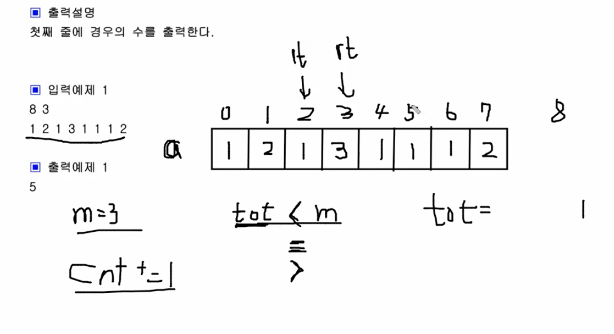<br/>

```swift
let nm = readLine()!.split(separator: " ").map { Int($0)! }
let (n, m) = (nm[0], nm[1])

let a = readLine()!.split(separator: " ").map { Int($0)! }

var lt = 0
var rt = 1
var tot = a[0]
var cnt = 0

while true {
    if tot < m {
        if rt < n {
            tot += a[rt]
            rt += 1
        } else {
            break
        }
    } else if tot == m {
        cnt += 1
        tot -= a[lt]
        lt += 1
    } else {
        tot -= a[lt]
        lt += 1
    }
}

print(cnt)
```

#

### 16. 격자판 최대합

N*N의 격자판이 주어지면 각 행의 합, 각 열의 합, 두 대각선의 합 중 가 장 큰 합을 출력합니다.<br/>

▣ 입력설명<br/>
첫 줄에 자연수 N이 주어진다.(1<=N<=50) <br/>
두 번째 줄부터 N줄에 걸쳐 각 줄에 N개의 자연수가 주어진다.<br/>
각 자연수는 100을 넘지 않는다. <br/>

▣ 출력설명 <br/>
최대합을 출력합니다. <br/>

▣ 입력예제<br/>
5 <br/>
10 13 10 12 15 <br/>
12 39 30 23 11 <br/>
11 25 50 53 15 <br/>
19 27 29 37 27 <br/>
19 13 30 13 19 <br/>

▣ 출력예제 <br/>
155<br/>

&nbsp;&nbsp;&nbsp;&nbsp;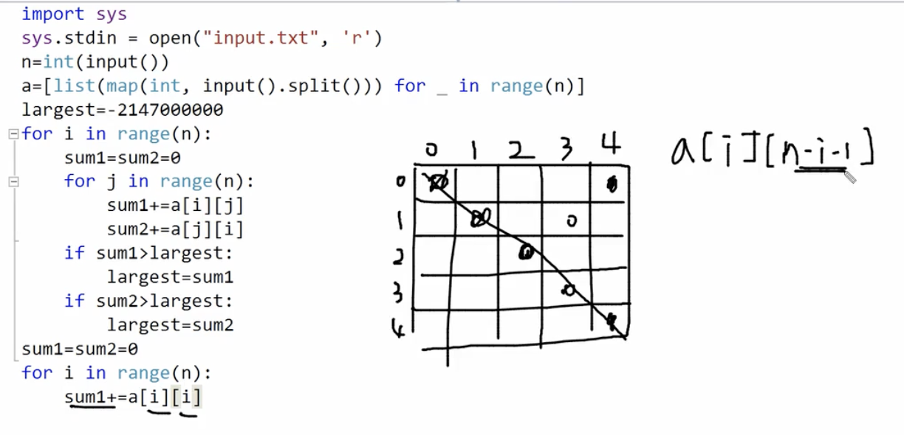<br/>

```Swift
import Foundation

let n = Int(readLine()!)!
var a: [[Int]] = []

for _ in 0..<n {
    let row = readLine()!.split(separator: " ").map { Int($0)! }
    a.append(row)
}

var largest = Int.min

for i in 0..<n {
    var sum1 = 0
    var sum2 = 0
    for j in 0..<n {
        sum1 += a[i][j]
        sum2 += a[j][i]
    }
    largest = max(largest, sum1, sum2)
}

var sum1 = 0
var sum2 = 0
for i in 0..<n {
    sum1 += a[i][i]
    sum2 += a[i][n-i-1]
}

largest = max(largest, sum1, sum2)
print(largest)
```

#

### 17. 사과나무 (다이아몬드)

현수의 농장은 N*N 격자판으로 이루어져 있으며, 각 격자안에는 한 그루의 사과나무가 심어저 있다. <br/>
N의 크기는 항상 홀수이다. 가을이 되어 사과를 수확해야 하는데 현수는 격자판안의 사과를 수확할 때 <br/>
다이아몬드 모양의 격자판만 수확하고 나머지 격자안의 사과는 새들을 위해서 남겨놓는다. <br/>
현수과 수확하는 사과의 총 개수를 출력하세요. <br/>

▣ 입력설명 <br/>
첫 줄에 자연수 N(홀수)이 주어진다.(3<=N<=20) <br/>
두 번째 줄부터 N줄에 걸쳐 각 줄에 N개의 자연수가 주어진다. <br/>
이 자연수는 각 격자안에 있는 사과나무에 열린 사과의 개수이다. <br/>
각 격자안의 사과의 개수는 100을 넘지 않는다. <br/>

▣ 출력설명 <br/>
수확한 사과의 총 개수를 출력합니다. <br/>

▣ 입력예제 <br/>
5 <br/>
10 13 10 12 15 <br/>
12 39 30 23 11 <br/> 
11 25 50 53 15 <br/>
19 27 29 37 27 <br/>
19 13 30 13 19 <br/>

▣ 출력예제 <br/>
379 <br/>

&nbsp;&nbsp;&nbsp;&nbsp;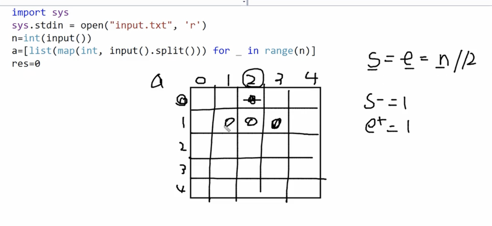<br/>

```swift
let n = Int(readLine()!)!
var a: [[Int]] = []

for _ in 0..<n {
    let row = readLine()!.split(separator: " ").map { Int($0)! }
    a.append(row)
}

var res = 0
var s = n / 2
var e = n / 2

for i in 0..<n {
    for j in s...e {
        res += a[i][j]
    }

    //좁혀졌다가
    if i < n / 2 {
        s -= 1
        e += 1
    } else {
        //넓혀졌다가
        s += 1
        e -= 1
    }
}

print(res)
```

#

### 18. 곳감 (모래시계)

현수는 곳감을 만들기 위해 감을 깍아 마당에 말리고 있습니다. 현수의 마당은 N*N 격자판으 로 이루어져 있으며,  <br/>
현수는 각 격자단위로 말리는 감의 수를 정합니다.<br/>
그런데 해의 위치에 따라 특정위치의 감은 잘 마르지 않습니다. 그래서 현수는 격자의 행을 기준으로 왼쪽,  <br/>
또는 오른쪽으로 회전시켜 위치를 변경해 모든 감이 잘 마르게 합니다.<br/>
만약 회전명령 정보가 2 0 3이면 2번째 행을 왼쪽으로 3만큼 아래 그림처럼 회전시키는 명령 입니다.<br/>

첫 번째 수는 행번호, 두 번째 수는 방향인데 0이면 왼쪽, 1이면 오른쪽이고, 세 번째 수는 회 전하는 격자의 수입니다.<br/>
M개의 회전명령을 실행하고 난 후 아래와 같이 마당의 모래시계 모양의 영역에는 <br/>
감이 총 몇 개가 있는지 출력하는 프로그램을 작성하세요.<br/>

▣ 입력설명 <br/>
첫 줄에 자연수 N(3<=N<=20) 이 주어며, N은 홀수입니다.<br/>
두 번째 줄부터 N줄에 걸쳐 각 줄에 N개의 자연수가 주어진다.<br/>
이 자연수는 각 격자안에 있는 감의 개수이며, 각 격자안의 감의 개수는 100을 넘지 않는다. <br/>
그 다음 줄에 회전명령의 개수인 M(1<=M<=10)이 주어지고, <br/>
그 다음 줄부터 M개의 회전명령 정보가 M줄에 걸쳐 주어집니다. <br/>

▣ 출력설명 <br/>
총 감의 개수를 출력합니다. <br/>

▣ 입력예제 <br/>
5 <br/>
10 13 10 12 15 <br/>
12 39 30 23 11 <br/>
11 25 50 53 15 <br/>
19 27 29 37 27 <br/>
19 13 30 13 19 <br/>
3 <br/>
2 0 3 <br/>
5 1 2 <br/>
3 1 4 <br/>

▣ 출력예제 <br/>
362 <br/>

&nbsp;&nbsp;&nbsp;&nbsp;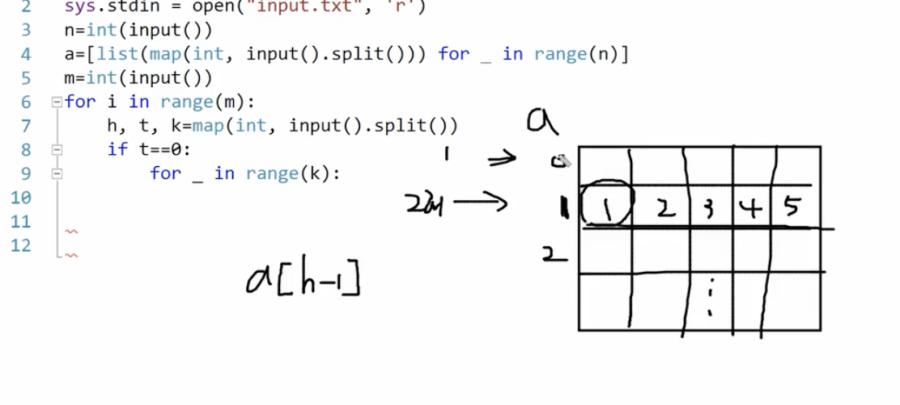<br/>

```swift
import Foundation

let n = Int(readLine()!)!
var a: [[Int]] = []

for _ in 0..<n {
    let row = readLine()!.split(separator: " ").map { Int($0)! }
    a.append(row)
}

let m = Int(readLine()!)!

for _ in 0..<m {
    let commands = readLine()!.split(separator: " ").map { Int($0)! }
    let (h, t, k) = (commands[0], commands[1], commands[2])
    
    if t == 0 {
        for _ in 0..<k {
            let first = a[h-1].removeFirst()
            a[h-1].append(first)
        }
    } else {
        for _ in 0..<k {
            let last = a[h-1].removeLast()
            a[h-1].insert(last, at: 0)
        }
    }
}

var res = 0
var s = 0
var e = n - 1

for i in 0..<n {
    for j in s...e {
        res += a[i][j]
    }
    if i < n / 2 {
        s += 1
        e -= 1
    } else {
        s -= 1
        e += 1
    }
}

print(res)
```

#

### 19. 봉우리 

지도 정보가 N*N 격자판에 주어집니다. 각 격자에는 그 지역의 높이가 쓰여있습니다. <br/>
각 격자 판의 숫자 중 자신의 상하좌우 숫자보다 큰 숫자는 봉우리 지역입니다. <br/>
봉우리 지역이 몇 개 있는 지 알아내는 프로그램을 작성하세요. <br/>
격자의 가장자리는 0으로 초기화 되었다고 가정한다. <br/>
만약 N=5 이고, 격자판의 숫자가 다음과 같다면 봉우리의 개수는 10개입니다. <br/>

▣ 입력설명 <br/>
첫 줄에 자연수 N이 주어진다.(1<=N<=50) <br/>
두 번째 줄부터 N줄에 걸쳐 각 줄에 N개의 자연수가 주어진다. <br/>
각 자연수는 100을 넘지 않는다. <br/>

▣ 출력설명 <br/>
봉우리의 개수를 출력하세요. <br/>

▣ 입력예제 <br/>
5 <br/>
5 3 7 2 3 <br/>
3 7 1 6 1 <br/>
7 2 5 3 4 <br/>
4 3 6 4 1 <br/>
8 7 3 5 2<br/>

▣ 출력예제 <br/>
10 <br/>

&nbsp;&nbsp;&nbsp;&nbsp;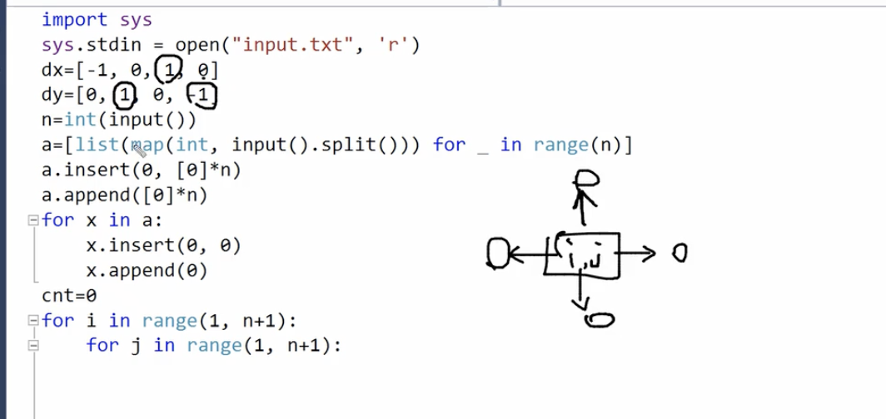<br/>

```swift
import Foundation

//상하좌우 탐색
let dx = [-1, 0, 1, 0]
let dy = [0, 1, 0, -1]

let n = Int(readLine()!)!
var a: [[Int]] = []

// Read the input and pad with zeros on all sides
for _ in 0..<n {
    let row = [0] + readLine()!.split(separator: " ").map { Int($0)! } + [0]
    a.append(row)
}
a.insert([Int](repeating: 0, count: n + 2), at: 0)
a.append([Int](repeating: 0, count: n + 2))

var cnt = 0

for i in 1...n {
    for j in 1...n {
        if (0..<4).allSatisfy({ a[i][j] > a[i + dx[$0]][j + dy[$0]] }) {
            cnt += 1
        }
    }
}

print(cnt)
```

#

### 20. 스도쿠 검사

스도쿠는 매우 간단한 숫자 퍼즐이다. 9×9 크기의 보드가 있을 때, <br/>
각 행과 각 열, 그리고 9 개의 3×3 크기의 보드에 1부터 9까지의 숫자가 중복 없이 나타나도록 보드를 채우면 된다. <br/>
예를 들어 다음을 보자.

&nbsp;&nbsp;&nbsp;&nbsp;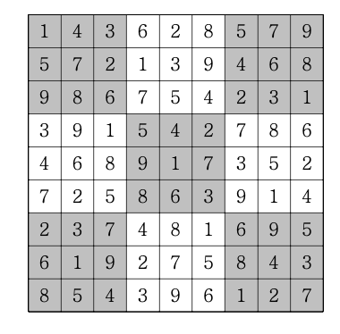<br/>

위 그림은 스도쿠를 정확하게 푼 경우이다. 각 행에 1부터 9까지의 숫자가 중복 없이 나오 고,  <br/>
각 열에 1부터 9까지의 숫자가 중복 없이 나오고,  <br/>
각 3×3짜리 사각형(9개이며, 위에서 색 깔로 표시되었다)에 1부터 9까지의 숫자가 중복 없이 나오기 때문이다.  <br/>
완성된 9×9 크기의 수도쿠가 주어지면 정확하게 풀었으면 “YES", 잘 못 풀었으면 ”NO"를 출 력하는 프로그램을 작성하세요.  <br/>

▣ 입력설명  <br/>
첫 번째 줄에 완성된 9×9 스도쿠가 주어집니다. <br/>

▣ 출력설명  <br/>
첫째 줄에 “YES" 또는 ”NO"를 출력하세요.  <br/>

▣ 입력예제  <br/>
1 4 3 6 2 8 5 7 9  <br/>
5 7 2 1 3 9 4 6 8  <br/>
9 8 6 7 5 4 2 3 1  <br/>
3 9 1 5 4 2 7 8 6  <br/>
4 6 8 9 1 7 3 5 2  <br/>
7 2 5 8 6 3 9 1 4  <br/>
2 3 7 4 8 1 6 9 5  <br/>
6 1 9 2 7 5 8 4 3  <br/>
8 5 4 3 9 6 1 2 7  <br/>

▣ 출력예제  <br/>
YES  <br/>

▣ 풀이로직 
- 행 / 열 / 3x3 박스 (그룹탐색)의 중복 숫자를 체크한다
- `a[i][j]`를 ch 배열에 넣어서 중복체크한다
- 그룹탐색은 4중 for 문을 돌리게 된다

&nbsp;&nbsp;&nbsp;&nbsp;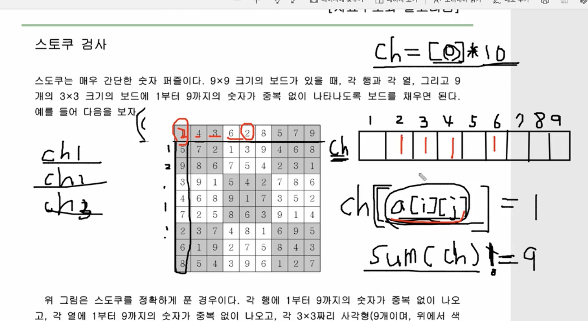<br/>

```Swift
import Foundation

func check(_ a: [[Int]]) -> Bool {
    
    for i in 0..<9 {
        var ch1 = Array(repeating: 0, count: 10)
        var ch2 = Array(repeating: 0, count: 10)
        for j in 0..<9 {
            ch1[a[i][j]] = 1
            ch2[a[j][i]] = 1
        }
        if ch1.reduce(0, +) != 9 || ch2.reduce(0, +) != 9 {
            return false
        }
    }

    for i in 0..<3 {
        for j in 0..<3 {
            var ch3 = Array(repeating: 0, count: 10)
            for k in 0..<3 {
                for s in 0..<3 {
                    ch3[a[i*3 + k][j*3 + s]] = 1
                }
            }
            if ch3.reduce(0, +) != 9 {
                return false
            }
        }
    }
    return true
}

var board: [[Int]] = []
for _ in 0..<9 {
    if let line = readLine()?.split(separator: " ").map({ Int($0)! }) {
        board.append(line)
    }
}

if check(board) {
    print("YES")
} else {
    print("NO")
}
```

#

### 21. 격자판 회문수
1부터 9까지의 자연수로 채워진 7*7 격자판이 주어지면 격자판 위에서 가로방향 또는 세로방향으로 <br/>
길이 5자리 회문수가 몇 개 있는지 구하는 프로그램을 작성하세요. <br/>
회문수란 121과 같이 앞에서부터 읽으나 뒤에서부터 읽으나 같은 수를 말합니다.<br/>

&nbsp;&nbsp;&nbsp;&nbsp;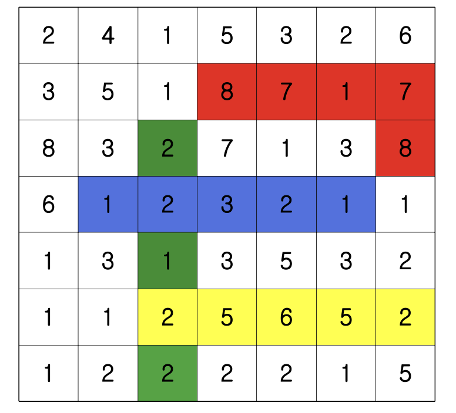<br/>

빨간색처럼 구부러진 경우(87178)는 회문수로 간주하지 않습니다.<br/>

▣ 입력설명<br/>
1부터 9까지의 자연수로 채워진 7*7격자판이 주어집니다.<br/>

▣ 출력설명<br/>
5자리 회문수의 개수를 출력합니다<br/>

▣ 입력예제<br/>
2 4 1 5 3 2 6 <br/>
3 5 1 8 7 1 7 <br/>
8 3 2 7 1 3 8 <br/>
6 1 2 3 2 1 1 <br/>
1 3 1 3 5 3 2 <br/>
1 1 2 5 6 5 2 <br/>
1 2 2 2 2 1 5 <br/>

▣ 출력예제<br/>
3 <br/>

▣ 풀이로직 <br/>
5개를 보면 되기 때문에 0,1,2까지만 돌면 되는 부분 <br/>

```swift
import Foundation

let board: [[Int]] = (0..<7).map { _ in readLine()!.split(separator: " ").map { Int($0)! } }
var cnt = 0

for i in 0..<3 {
    for j in 0..<7 {
        let tmp = Array(board[j][i..<i+5])
        if tmp == tmp.reversed() {
            cnt += 1
        }

        //5개 이기 때문에 양쪽 두 개만 비교하면 된다!
        for k in 0..<2 {
            if board[i+k][j] != board[i+5-k-1][j] {
                break
            } else {
                cnt += 1
            }
        }
    }
}

print(cnt)
```

#

### 22. 이분검색

임의의 N개의 숫자가 입력으로 주어집니다. <br/>
N개의 수를 오름차순으로 정렬한 다음 N개의 수 중 한 개의 수인 M이 주어지면 이분검색으로 M이 정렬된 상태에서 <br/>
몇 번째에 있는지 구하는 프로그램을 작성하세요. 단 중복값은 존재하지 않습니다. <br/>

▣ 입력설명 <br/>
첫 줄에 한 줄에 자연수 N(3<=N<=1,000,000)과 M이 주어집니다.<br/>
두 번째 줄에 N개의 수가 공백을 사이에 두고 주어집니다.<br/>

▣ 출력설명 <br/>
첫 줄에 정렬 후 M의 값의 위치 번호를 출력한다. <br/>

▣ 입력예제 <br/>
8 32 <br/>
23 87 65 12 57 32 99 81 <br/>

▣ 출력예제 <br/>
3


```Swift
import Foundation

let inputs = readLine()!.split(separator: " ").map { Int($0)! }
let n = inputs[0]
let m = inputs[1]

var a = readLine()!.split(separator: " ").map { Int($0)! }
a.sort()

var lt = 0
var rt = n - 1

while lt <= rt {
    let mid = (lt + rt) / 2
    if a[mid] == m {
        print(mid + 1)
        break
    } else if a[mid] > m {
        rt = mid - 1
    } else {
        lt = mid + 1
    }
}
```

#

### 23. 랜선 자르기 (결정 알고리즘)

엘리트 학원은 자체적으로 K개의 랜선을 가지고 있다. <br/>
그러나 K개의 랜선은 길이가 제각각이다. 선생님은 랜선을 모두 N개의 같은 길이의 랜선으로 만들고 싶었기 때문에 <br/>
K개의 랜선을 잘라서 만들어야 한다. <br/>
예를 들어 300cm 짜리 랜선에서 140cm 짜리 랜선을 두 개 잘라내면 20cm 은 버려야 한다. <br/>
(이미 자른 랜선은 붙일 수 없다.) <br/>
편의를 위해 랜선을 자를때 손실되는 길이는 없다고 가정하며, <br/>
기존의 K개의 랜선으로 N개의 랜선을 만들 수 없는 경우는 없다고 가정하자. <br/>
그리고 자를 때는 항상 센티미터 단위로 정수 길이만큼 자른다고 가정하자. <br/>
N개보다 많이 만드는 것도 N개를 만드는 것에 포함된다. <br/>
이때 만들 수 있는 최대 랜선의 길이를 구하는 프로그램을 작성하시오.<br/>

▣ 입력설명 <br/>
첫째 줄에는 엘리트학원이 이미 가지고 있는 랜선의 개수 K, 그리고 필요한 랜선의 개수 N이 입력된다. <br/>
K는 1이상 10,000이하의 정수이고, N은 1이상 1,000,000이하의 정수이다. 그리고 항상 K ≦ N 이다. <br/>
그 후 K줄에 걸쳐 이미 가지고 있는 각 랜선의 길이가 센티미터 단위의 2^31-1이하의 자연수로 주어진다. <br/>

▣ 출력설명 <br/>
첫째 줄에 N개를 만들 수 있는 랜선의 최대 길이를 센티미터 단위의 정수로 출력한다. <br/>

▣ 입력예제 <br/>
4 11  <br/>
802 <br/>
743 <br/>
457 <br/>
539 <br/>

▣ 출력예제 <br/>
200 <br/>

▣ 풀이로직 <br/>
결정알고리즘의 특징은 답이 몇부터 몇사이까지 범위가 있다는 것을 알 수 있다.<br/>
범위를 알기때문에 중앙값을 설정할 수 있고 이분탐색이 가능해짐 <br/>

&nbsp;&nbsp;&nbsp;&nbsp;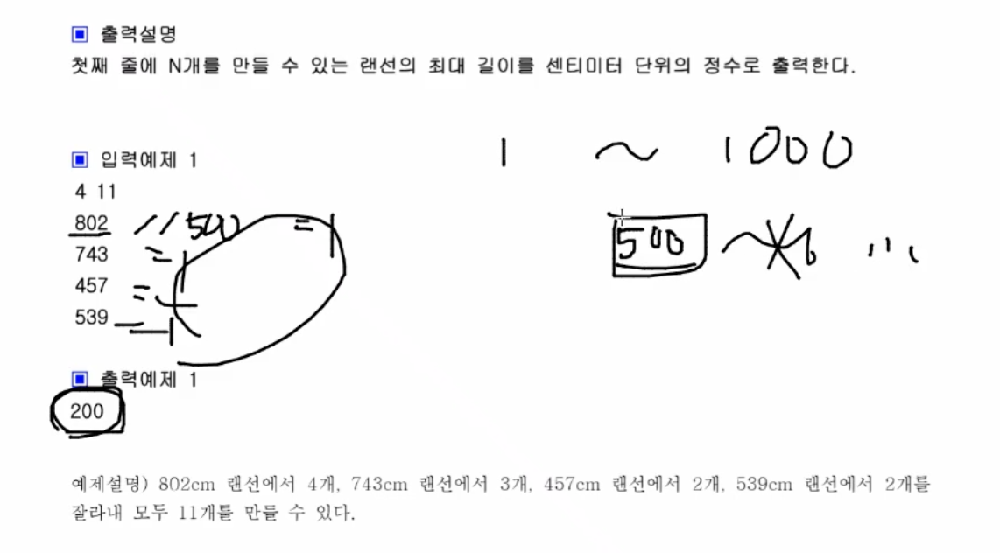<br/>

```swift
import Foundation

func count(_ len: Int, _ lines: [Int]) -> Int {
    var cnt = 0
    for line in lines {
        cnt += line / len
    }
    return cnt
}

let inputs = readLine()!.split(separator: " ").map { Int($0)! }
let k = inputs[0]
let n = inputs[1]

var lines: [Int] = []
var largest = 0

for _ in 0..<k {
    let length = Int(readLine()!)!
    lines.append(length)
    largest = max(largest, length)
}

var lt = 1
var rt = largest
var res = 0

while lt <= rt {
    let mid = (lt + rt) / 2
    if count(mid, lines) >= n {
        res = mid
        lt = mid + 1
    } else {
        rt = mid - 1
    }
}

print(res)
```

#

### 24. 뮤직비디오 (결정 알고리즘)

지니레코드에서는 불세출의 가수 조영필의 라이브 동영상을 DVD로 만들어 판매하려 한다. <br/>
DVD에는 총 N개의 곡이 들어가는데, DVD에 녹화할 때에는 라이브에서의 순서가 그대로 유지 되어야 한다. <br/>
순서가 바뀌는 것을 우리의 가수 조영필씨가 매우 싫어한다.<br/>
즉, 1번 노래와 5번 노래를 같은 DVD에 녹화하기 위해서는 
1번과 5번 사이의 모든 노래도 같은 DVD에 녹화해야 한다. <br/>
또한 한 노래를 쪼개서 두 개의 DVD에 녹화하면 안된다. <br/>
지니레코드 입장에서는 이 DVD가 팔릴 것인지 확신할 수 없기 때문에 <br/>
이 사업에 낭비되는 DVD를 가급적 줄이려고 한다. <br/>
고민 끝에 지니레코드는 M개의 DVD에 모든 동영상을 녹화하기 로 하였다. <br/>
이 때 DVD의 크기(녹화 가능한 길이)를 최소로 하려고 한다. <br/> 
그리고 M개의 DVD는 모두 같은 크기여야 제조원가가 적게 들기 때문에 꼭 같은 크기로 해야 한다. <br/>

▣ 입력설명 <br/>
첫째 줄에 자연수 N(1≤N≤1,000), M(1≤M≤N)이 주어진다. <br/>
다음 줄에는 조영필이 라이브에서 부른 순서대로 부른 곡의 길이가 분 단위로(자연수) 주어진다.  <br/>
부른 곡의 길이는 10,000분을 넘지 않는다고 가정하자. <br/>

▣ 출력설명 <br/>
첫 번째 줄부터 DVD의 최소 용량 크기를 출력하세요. <br/>
3개의 DVD용량이 17분짜리이면 (1, 2, 3, 4, 5) (6, 7), (8, 9) 이렇게 3개의 DVD로 녹음을 할 수 있다. <br/> 
17분 용량보다 작은 용량으로는 3개의 DVD에 모든 영상을 녹화할 수 없다. <br/>

▣ 입력예제 <br/>
93 <br/>
1 2 3 4 5 6 7 8 9 <br/>

▣ 출력예제 <br/>
17 <br/>

```Swift
import Foundation

func count(_ capacity: Int, _ music: [Int]) -> Int {
    var cnt = 1
    var sum = 0
    for length in music {
        if sum + length > capacity {
            cnt += 1
            sum = length
        } else {
            sum += length
        }
    }
    return cnt
}

let inputs = readLine()!.split(separator: " ").map { Int($0)! }
let n = inputs[0]
let m = inputs[1]

let music = readLine()!.split(separator: " ").map { Int($0)! }
let maxx = music.max() ?? 0
var lt = 1
var rt = music.reduce(0, +)
var res = 0

while lt <= rt {
    let mid = (lt + rt) / 2
    if mid >= maxx && count(mid, music) <= m {
        res = mid
        rt = mid - 1
    } else {
        lt = mid + 1
    }
}

print(res)
```

#

### 25. 마구간 정하기 

N개의 마구간이 수직선상에 있습니다. <br/>
각 마구간은 x1, x2, x3, ......, xN의 좌표를 가지며, 마구간 간에 좌표가 중복되는 일은 없습니다. <br/>
현수는 C마리의 말을 가지고 있는데, 이 말들은 서로 가까이 있는 것을 좋아하지 않습니다. <br/>
각 마구간에는 한 마리의 말만 넣을 수 있고, 가장 가까운 두 말의 거리가 최대가 되게 말을 마구간에 배치하고 싶습니다. <br/>
C마리의 말을 N개의 마구간에 배치했을 때 가장 가까운 두 말의 거리가 최대가 되는 그 최대 값을 출력하는 프로그램을 작성하세요. <br/>

▣ 입력설명 <br/>
첫 줄에 자연수 N(3<=N<=200,000)과 C(2<=C<=N)이 공백을 사이에 두고 주어집니다. <br/>
둘째 줄부터 N개의 줄에 걸쳐 마구간의 좌표 xi(0<=xi<=1,000,000,000)가 한 줄에 하나씩 주어집니다. <br/>

▣ 출력설명 <br/>
첫 줄에 가장 가까운 두 말의 최대 거리를 출력하세요. <br/>

▣ 입력예제 <br/>
5 3 <br/>
1 <br/>
2 <br/>
8 <br/> 
4 <br/> 
9 <br/>

▣ 출력예제 <br/>
3 <br/>

```swift
import Foundation

func count(_ len: Int, _ line: [Int]) -> Int {
    var cnt = 1
    var ep = line[0]
    
    for val in line.dropFirst() where val - ep >= len {
        cnt += 1
        ep = val
    }
    
    return cnt
}

let input = readLine()!.split(separator: " ").map { Int($0)! }
let (n, c) = (input[0], input[1])
let line = (0..<n).map { _ in Int(readLine()!)! }.sorted()

var (lt, rt, res) = (1, line.last!, 0)

while lt <= rt {
    let mid = (lt + rt) / 2
    if count(mid, line) >= c {
        res = mid
        lt = mid + 1
    } else {
        rt = mid - 1
    }
}

print(res)
```
#

### 26. 회의실 배정 

한 개의 회의실이 있는데 이를 사용하고자 하는 n개의 회의들에 대하여 회의실 사용표를 만들 려고 한다. <br/>
각 회의에 대해 시작시간과 끝나는 시간이 주어져 있고, 각 회의가 겹치지 않게 하 면서 회의실을 사용할 수 있는 최대수의 회의를 찾아라. <br/>
단, 회의는 한번 시작하면 중간에 중 단될 수 없으며 한 회의가 끝나는 것과 동시에 다음 회의가 시작될 수 있다. <br/>

▣ 입력설명 <br/>
첫째 줄에 회의의 수 n(1<=n<=100,000)이 주어진다. <br/>
둘째 줄부터 n+1 줄까지 각 회의의 정 보가 주어지는데  <br/>
이것은 공백을 사이에 두고 회의의 시작시간과 끝나는 시간이 주어진다. <br/>

▣ 출력설명 <br/>
첫째 줄에 최대 사용할 수 있는 회의 수를 출력하여라. <br/>

▣ 입력예제 <br/>
5 <br/>
1 4 <br/>
2 3 <br/>
3 5 <br/>
4 6 <br/>
5 7 <br/> 

▣ 출력예제 <br/>
3 <br/>

▣ 예제설명 <br/>
(2, 3) , (3, 5), (5, 7)이 회의실을 이용할 수 있다 <br/>

```Swift
import Foundation

let n = Int(readLine()!)!
var meetings: [(Int, Int)] = []

for _ in 0..<n {
    let input = readLine()!.split(separator: " ").map { Int($0)! }
    meetings.append((input[0], input[1]))
}

meetings.sort { $0.1 == $1.1 ? $0.0 < $1.0 : $0.1 < $1.1 }

var endTime = 0
var count = 0

for meeting in meetings {
    if meeting.0 >= endTime {
        endTime = meeting.1
        count += 1
    }
}

print(count)
```

#

### 27. 씨름선수 (그리디)

현수는 씨름 감독입니다. 현수는 씨름 선수를 선발공고를 냈고, N명의 지원자가 지원을 했습 니다. <br/>
현수는 각 지원자의 키와 몸무게 정보를 알고 있습니다.  <br/>
현수는 씨름 선수 선발 원칙을 다음과 같이 정했습니다.  <br/>
“다른 모든 지원자와 일대일 비교하여 키와 몸무게 중 적어도 하나는 크거나, 무거운 지원자 만 뽑기로 했습니다.”  <br/>
만약 A라는 지원자보다 키도 크고 몸무게도 무거운 지원자가 존재한다면 A지원자는 탈락입니다.  <br/>

▣ 입력설명  <br/>
첫째 줄에 지원자의 수 N(5<=N<=50)이 주어집니다.  <br/>
두 번째 줄부터 N명의 키와 몸무게 정보가 차례로 주어집니다.  <br/>
각 선수의 키와 몸무게는 모두 다릅니다.  <br/>

▣ 출력설명  <br/>
첫째 줄에 씨름 선수로 뽑히는 최대 인원을 출력하세요.  <br/>

▣ 입력예제  <br/>
5  <br/>
172 67  <br/>
183 65  <br/>
180 70  <br/>
170 72  <br/>
181 60  <br/>

▣ 출력예제  <br/>
3 <br/>

▣ 출력설명  <br/>
(183, 65), (180, 70), (170, 72)가 선발됩니다. (181, 60)은 (183, 65) 때문에 탈락하고,   <br/>
(172, 67)은 (180, 70) 때문에 탈락합니다.  <br/>

```swift
import Foundation

if let n = Int(readLine()!)! 
    
var players: [(height: Int, weight: Int)] = []

for _ in 0..<n {
    if let line = readLine() {
        let values = line.split(separator: " ").map { Int($0)! }
        players.append((height: values[0], weight: values[1]))
        }
}

players.sort { $0.height > $1.height }

var largestWeight = 0
var count = 0

for player in players {
    if player.weight > largestWeight {
        largestWeight = player.weight
        count += 1
    }
}
print(count)
```

#

### 28. 창고정리 (그리디)

창고에 상자가 가로방향으로 일렬로 쌓여 있습니다. 만약 가로의 길이가 7이라면 <br/>

&nbsp;&nbsp;&nbsp;&nbsp;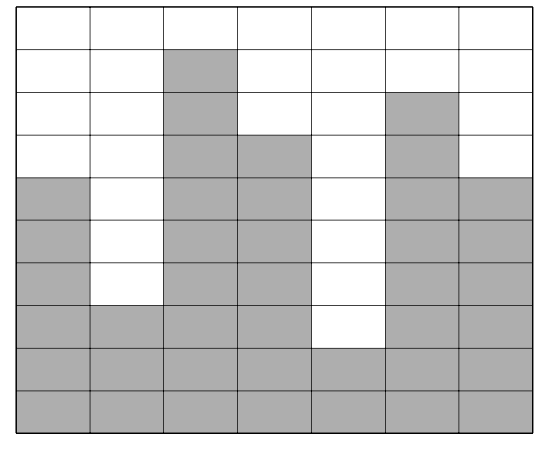<br/>

1열은 높이가 6으로 6개의 상자가 쌓여 있고, 2열은 3개의 상자, 3열은 9개의 상자가 쌓여 있 으며 높이는 9라고 읽는다. <br/>
창고 높이 조정은 가장 높은 곳에 상자를 가장 낮은 곳으로 이동하는 것을 말한다. <br/>
가장 높은 곳이나 가장 낮은 곳이 여러곳이면 그 중 아무거나 선택하면 된다. <br/>
위에 그림을 1회 높이 조정을 하면 다음과 같아진다. <br/>

&nbsp;&nbsp;&nbsp;&nbsp;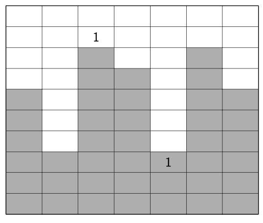<br/>

창고의 가로 길이와 각 열의 상자 높이가 주어집니다.  <br/>
m회의 높이 조정을 한 후 가장 높은 곳 과 가장 낮은 곳의 차이를 출력하는 프로그램을 작성하세요. <br/>

▣ 입력설명 <br/>
첫 번째 줄에 창고 가로의 길이인 자연수 L(1<=L<=100)이 주어집니다. <br/>
두 번째 줄에 L개의 자연수가 공백을 사이에 두고 입력됩니다. 각 자연수는 100을 넘지 않습니다 <br/>
세 번째 줄에 높이 조정 횟수인 M(1<=M<=1,000)이 주어집니다. <br/>

▣ 출력설명 <br/>
M회의 높이 조정을 마친 후 가장 높은곳과 가장 낮은 곳의 차이를 출력하세요. <br/>

▣ 입력예제 <br/>
10  <br/>
69 42 68 76 40 87 14 65 76 81 <br/>
50 <br/>

▣ 출력예제 <br/>
20 <br/>

```swift
import Foundation

let L = Int(readLine()!)!
var heights = readLine()!.split(separator: " ").map { Int($0)! }
let m = Int(readLine()!)!

for _ in 0..<m {
    heights.sort()
    heights[0] += 1
    heights[L-1] -= 1
}

print(heights.max()! - heights.min()!)
```

#

### 29. 침몰하는 타이타닉 (그리디)

유럽에서 가장 유명했던 유람선 타이타닉이 침몰하고 있습니다. 
유람선에는 N명의 승객이 타고 있습니다. 
구명보트를 타고 탈출해야 하는데 타이타닉에 있는 구명보트는 2명 이하로만 탈 수 있 으며, 
보트 한 개에 탈 수 있는 총 무게도 M kg 이하로 제한되어 있습니다.
N명의 승객 몸무게가 주어졌을 때 승객 모두가 탈출하기 위한 구명보트의 최소개수를 출력하는 프로그램을 작성하세요.

▣ 입력설명
첫째 줄에 자연수 N(5<=N<=1000)과 M(70<=M<=250)이 주어집니다.
두 번째 줄에 N개로 구성된 몸무게 수열이 주어집니다. 몸무게는 50이상 150이하입니다. 
각 승객의 몸무게는 M을 넘지는 않습니다. 즉 탈출을 못하는 경우는 없습니다.

▣ 출력설명
첫째 줄에 구명보트의 최소 개수를 출력합니다.

▣ 입력예제 
5 140
90 50 70 100 60

▣ 출력예제 
3

```swift
import Foundation

let inputs = readLine()!.split(separator: " ").map { Int($0)! }
let (n, limit) = (inputs[0], inputs[1])
var weights = readLine()!.split(separator: " ").map { Int($0)! }.sorted()

var count = 0

while !weights.isEmpty {
    if weights.count == 1 {
        count += 1
        break
    }
    
    if weights.first! + weights.last! > limit {
        weights.removeLast()
    } else {
        weights.removeFirst()
        weights.removeLast()
    }
    count += 1
}

print(count)
```
#

### 30. 증가수열 만들기 (그리디)

1부터 N까지의 모든 자연수로 구성된 길이 N의 수열이 주어집니다. <br/>
이 수열의 왼쪽 맨 끝 숫자 또는 오른쪽 맨 끝 숫자 중 하나를 가져와 나열하여 가장 긴 증가수열 을 만듭니다. <br/>
이때 수열에서 가져온 숫자(왼쪽 맨 끝 또는 오른쪽 맨 끝)는 그 수열에서 제거됩니다. <br/>
예를 들어 2 4 5 1 3 이 주어지면 만들 수 있는 가장 긴 증가수열의 길이는 4입니다.  <br/>
맨 처음 왼쪽 끝에서 2를 가져오고, 그 다음 오른쪽 끝에서 3을 가져오고,  <br/> 
왼쪽 끝에서 4, 왼쪽끝에서5를가져와 2345증가수열을만들수있습니다.  <br/>

▣ 입력설명  <br/>
첫째 줄에 자연수 N(3<=N<=100)이 주어집니다. 두 번째 줄에 N개로 구성된 수열이 주어집니다.  <br/>
▣ 출력설명
첫째 줄에 최대 증가수열의 길이를 출력합니다.
두 번째 줄에 가져간 순서대로 왼쪽 끝에서 가져갔으면 ‘L', 오른쪽 끝에서 가져갔으면 ’R'를 써 간 문자열을 출력합니다.(단 마지막에 남은 값은 왼쪽 끝으로 생각합니다.)
▣ 입력예제
5
24513

▣ 출력예제
4
LRLL

▣ 입력예제
10
3 2 10 1 5 4 7 8 9 6

▣ 출력예제 
3
LRR

```swift
let n = Int(readLine()!)!
var sequence = readLine()!.split(separator: " ").map { Int($0)! }

var lt = 0, rt = n - 1, last = 0, res = ""

while lt <= rt {
    var choices: [(Int, String)] = []
    
    if sequence[lt] > last { choices.append((sequence[lt], "L")) }
    if sequence[rt] > last { choices.append((sequence[rt], "R")) }
    
    if let choice = choices.sorted(by: { $0.0 < $1.0 }).first {
        res += choice.1
        last = choice.0
        choice.1 == "L" ? (lt += 1) : (rt -= 1)
    } else {
        break
    }
}

print(res.count)
print(res)
```

#

### 31. 역수열 (그리디) 

1부터 n까지의 수를 한 번씩만 사용하여 이루어진 수열이 있을 때, 1부터 n까지 <br/> 
각각의 수 앞 에 놓여 있는 자신보다 큰 수들의 개수를 수열로 표현한 것을 역수열이라 한다. <br/> 
예를 들어 다음과 같은 수열의 경우  <br/> 
4 8 6 2 5 1 3 7 <br/> 
1 앞에 놓인 1보다 큰 수는 4, 8, 6, 2, 5 이렇게 5개이고, <br/> 
2 앞에 놓인 2보다 큰 수는 4, 8, 6 이렇게 3개, <br/> 
3 앞에 놓인 3보다 큰 수는 4, 8, 6, 5 이렇게 4개 .... <br/> 

따라서 4 8 6 2 5 1 3 7의 역수열은 5 3 4 0 2 1 1 0 이 된다 <br/> 
n과 1부터 n까지의 수를 사용하여 이루어진 수열의 역수열이 주어졌을 때,  <br/> 
원래 수열을 출력하는 프로그램을 작성하세요


▣ 입력설명 <br/> 
첫 번째 줄에 자연수 N(3<=N<100)이 주어지고,  <br/> 
두 번째 줄에는 역수열이 숫자 사이에 한 칸의 공백을 두고 주어진다 <br/> 

▣ 출력설명  <br/> 
원래 수열을 출력합니다 <br/> 

▣ 입력예제  <br/> 
8 <br/> 
5 3 4 0 2 1 1 0 <br/> 

▣ 출력예제 <br/> 
4 8 6 2 5 1 3 7 <br/> 

```swift
let n = Int(readLine()!)!
var inverseSequence = readLine()!.split(separator: " ").map { Int($0)! }
var sequence = [Int](repeating: 0, count: n)

for i in 0..<n {
    for j in 0..<n {
        if inverseSequence[i] == 0, sequence[j] == 0 {
            sequence[j] = i + 1
            break
        } else if sequence[j] == 0 {
            inverseSequence[i] -= 1
        }
    }
}

print(sequence.map { String($0) }.joined(separator: " "))
```

#

### 32. 가장 큰 수 (그리디) 

선생님은 현수에게 숫자 하나를 주고, 해당 숫자의 자릿수들 중 m개의 숫자를 제거하여 <br/>
가장 큰 수를 만들라고 했습니다. 여러분이 현수를 도와주세요.(단 숫자의 순서는 유지해야 합니다) <br/>
만약 5276823 이 주어지고 3개의 자릿수를 제거한다면 <br/>
7823이 가장 큰 숫자가 됩니다. <br/>

▣ 입력설명 <br/>
첫째 줄에 숫자(길이는 1000을 넘지 않습니다)와 제가해야할 자릿수의 개수가 주어집니다. <br/>

▣ 출력설명 <br/>
가장 큰 수를 출력합니다. <br/>

▣ 입력예제 <br/>
5276823 3 <br/>

▣ 출력예제 <br/>
7823 <br/>

▣ 입력예제 <br/>
9977252641 5 <br/>

▣ 출력예제 <br/>
99776 <br/>

```swift
import Foundation

let inputs = readLine()!.split(separator: " ").map { String($0) }
let num = Array(inputs[0])
let m = Int(inputs[1])!
var stack: [Character] = []
var deletions = m

for x in num {
    while !stack.isEmpty, deletions > 0, stack.last! < x {
        stack.removeLast()
        deletions -= 1
    }
    stack.append(x)
}

if deletions > 0 {
    stack = Array(stack.dropLast(deletions))
}

print(stack.map { String($0) }.joined())

````

#

### 33 쇠막대기 

여러 개의 쇠막대기를 레이저로 절단하려고 한다. <br/>
효율적인 작업을 위해서 쇠막대기를 아래에 서 위로 겹쳐 놓고, 레이저를 위에서 수직으로 발사하여 쇠막대기들을 자른다.  <br/>
쇠막대기와 레 이저의 배치는 다음 조건을 만족한다. <br/>
• 쇠막대기는 자신보다 긴 쇠막대기 위에만 놓일 수 있다. - 쇠막대기를 다른 쇠막대기 위에 놓는 경우 완전히 포함되도록 놓되, 끝점은 겹치지 않도록 놓는다. <br/>
• 각 쇠막대기를 자르는 레이저는 적어도 하나 존재한다. <br/>
• 레이저는 어떤 쇠막대기의 양 끝점과도 겹치지 않는다. <br/>
아래 그림은 위 조건을 만족하는 예를 보여준다. 수평으로 그려진 굵은 실선은 쇠막대기이고, 점은 레이저의 위치, 수직으로 그려진 점선 화살표는 레이저의 발사 방향이다. <br/>

&nbsp;&nbsp;&nbsp;&nbsp;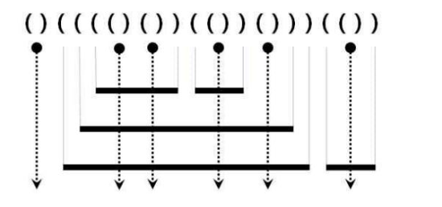<br/>

이러한 레이저와 쇠막대기의 배치는 다음과 같이 괄호를 이용하여 왼쪽부터 순서대로 표현할 수 있다. <br/>
1. 레이저는 여는 괄호와 닫는 괄호의 인접한 쌍 ‘( ) ’ 으로 표현된다. 또한, 모든 ‘( ) ’는 반 드시 레이저를 표현한다. <br/>
2. 쇠막대기의 왼쪽 끝은 여는 괄호 ‘ ( ’ 로, 오른쪽 끝은 닫힌 괄호 ‘) ’ 로 표현된다. <br/>
위 예의 괄호 표현은 그림 위에 주어져 있다. <br/>
쇠막대기는 레이저에 의해 몇 개의 조각으로 잘려지는데, 위 예에서 가장 위에 있는 두 개의 쇠막대기는 각각 3개와 2개의 조각으로 잘려지고, 이와 같은 방식으로 주어진 쇠막대기들은 총 17개의 조각으로 잘려진다. <br/>
쇠막대기와 레이저의 배치를 나타내는 괄호 표현이 주어졌을 때, 잘려진 쇠막대기 조각의 총 개수를 구하는 프로그램을 작성하시오. <br/>

▣ 입력설명  <br/>
한 줄에 쇠막대기와 레이저의 배치를 나타내는 괄호 표현이 공백없이 주어진다. 괄호 문자의 개수는 최대 100,000이다. <br/>

▣ 출력설명 <br/>
잘려진 조각의 총 개수를 나타내는 정수를 한 줄에 출력한다. <br/>

▣ 입력예제 ()(((()())(())()))(()) <br/>

▣ 출력예제 17 <br/>

▣ 입력예제 (((()(()()))(())()))(()()) <br/>

▣ 출력예제 24 <br/>

```swift
import Foundation

let s = Array(readLine()!)
var stack: [Character] = []
var cnt = 0

for i in 0..<s.count {
    if s[i] == "(" {
        stack.append(s[i])
    } else {
        stack.removeLast()
        cnt += s[i-1] == "(" ? stack.count : 1
    }
}

print(cnt)
```

#

### 34. 후위 표기식 만들기

중위표기식이 입력되면 후위표기식으로 변환하는 프로그램을 작성하세요. <br/>
중위표기식은 우리가 흔히 쓰은 표현식입니다. 즉 3+5 와 같이 연산자가 피연산자 사이에 있 으면 중위표기식입니다. <br/>
후위표기식은 35+ 와 같이 연산자가 피연산자 뒤에 있는 표기식입니다. <br/>
예를 들어 중위표기식이 3+5*2 를 후위표기식으로 표현하면 352*+ 로 표현됩니다. <br/>
만약 다음과 같이 연산 최우선인 괄호가 표현된 식이라면 <br/>
(3+5)*2 이면 35+2* 로 바꾸어야 합니다. <br/>
※후위 표기식이 이해가 안되면 구글링으로 공부해보는 것도 좋습니다. <br/>

▣ 입력설명 <br/>
첫 줄에 중위표기식이 주어진다. 길이는 100을 넘지 않는다. 
식은 1~9의 숫자와 +, -, *, /, (, ) 연산자로만 이루어진다. <br/>

▣ 출력설명 후위표기식을 출력한다. <br/>

▣ 입력예제 3+5*2/(7-2) <br/>

▣ 출력예제 352*72-/+ <br/>

▣ 입력예제 3*(5+2)-9 <br/>

▣ 출력예제 352+*9- <br/>

```Swift
import Foundation

let expression = Array(readLine()!)
var stack: [Character] = []
var result = ""

for char in expression {
    if char.isNumber {
        result.append(char)
    } else {
        switch char {
        case "(":
            stack.append(char)
        case "*", "/":
            while let last = stack.last, last == "*" || last == "/" {
                result.append(stack.removeLast())
            }
            stack.append(char)
        case "+", "-":
            while let last = stack.last, last != "(" {
                result.append(stack.removeLast())
            }
            stack.append(char)
        case ")":
            while let last = stack.last, last != "(" {
                result.append(stack.removeLast())
            }
            stack.removeLast()
        default:
            break
        }
    }
}

while let last = stack.last {
    result.append(stack.removeLast())
}

print(result)
```

#

### 35. 후위식 연산

후위연산식이 주어지면 연산한 결과를 출력하는 프로그램을 작성하세요. <br/>
만약 3*(5+2)-9 을 후위연산식으로 표현하면 352+*9- 로 표현되며 그 결과는 21입니다. <br/>

▣ 입력설명 <br/>
첫 줄에 후위연산식이 주어집니다. 연산식의 길이는 50을 넘지 않습니다. <br/>
식은 1~9의 숫자와 +, -, *, /, (, ) 연산자로만 이루어진다. <br/>

▣ 출력설명 <br/>
연산한 결과를 출력합니다. <br/>

▣ 입력예제 <br/>
352+*9- <br/>

▣ 출력예제 <br/>
12 <br/>

```Swift
let expression = readLine()!
var stack: [Int] = []

for char in expression {
    if let num = Int(String(char)) {
        stack.append(num)
    } else {
        let n1 = stack.popLast()!
        let n2 = stack.popLast()!
        switch char {
        case "+":
            stack.append(n2 + n1)
        case "-":
            stack.append(n2 - n1)
        case "*":
            stack.append(n2 * n1)
        case "/":
            stack.append(n2 / n1)
        default:
            break
        }
    }
}

print(stack[0])
```

#

### 36. 공주 구하기(큐 자료구조로 해결)

정보 왕국의 이웃 나라 외동딸 공주가 숲속의 괴물에게 잡혀갔습니다. <br/>
정보 왕국에는 왕자가 N명이 있는데 서로 공주를 구하러 가겠다고 합니다. 정보왕국의 왕은 다음과 같은 방법으로 공주를 구하러 갈 왕자를 결정하기로 했습니다. <br/>
왕은 왕자들을 나이 순으로 1번부터 N번까지 차례로 번호를 매긴다. 그리고 1번 왕자부터 N 번 왕자까지 순서대로 시계 방향으로 돌아가며 동그랗게 앉게 한다. <br/> 
그리고 1번 왕자부터 시 계방향으로 돌아가며 1부터 시작하여 번호를 외치게 한다.  <br/>
한 왕자가 K(특정숫자)를 외치면 그 왕자는 공주를 구하러 가는데서 제외되고 원 밖으로 나오게 된다. 그리고 다음 왕자부터 다시 1부터 시작하여 번호를 외친다. <br/>
이렇게 해서 마지막까지 남은 왕자가 공주를 구하러 갈 수 있다. <br/>

예를 들어 총 8명의 왕자가 있고, 3을 외친 왕자가 제외된다고 하자. 처음에는 3번 왕자가 3 을 외쳐 제외된다.  <br/>
이어 6, 1, 5, 2, 8, 4번 왕자가 차례대로 제외되고 마지막까지 남게 된 7 번 왕자에게 공주를 구하러갑니다. <br/>
N과 K가 주어질 때 공주를 구하러 갈 왕자의 번호를 출력하는 프로그램을 작성하시오. <br/>

▣ 입력설명 <br/>
첫 줄에 자연수 N(5<=N<=1,000)과 K(2<=K<=9)가 주어진다. <br/>

▣ 출력설명 <br/>
첫 줄에 마지막 남은 왕자의 번호를 출력합니다. <br/>

▣ 입력예제  <br/>
83 <br/>

▣ 출력예제 <br/>  
7 <br/>

```Swift
import Foundation

let inputs = readLine()!.split(separator: " ").map { Int($0)! }
let (n, k) = (inputs[0], inputs[1])

var dq = Array(1...n)

while dq.count > 1 {
    for _ in 1..<k {
        let first = dq.removeFirst()
        dq.append(first)
    }
    dq.removeFirst()
}

print(dq[0])

```

#

### 37. 응급실 

메디컬 병원 응급실에는 의사가 한 명밖에 없습니다. <br/>
응급실은 환자가 도착한 순서대로 진료를 합니다. 하지만 위험도가 높은 환자는 빨리 응급조 치를 의사가 해야 합니다. <br/>
이런 문제를 보완하기 위해 응급실은 다음과 같은 방법으로 환자의 진료순서를 정합니다. <br/>
• 환자가 접수한 순서대로의 목록에서 제일 앞에 있는 환자목록을 꺼냅니다. <br/>
• 나머지 대기 목록에서 꺼낸 환자 보다 위험도가 높은 환자가 존재하면 대기목록 제일 뒤로 <br/>
다시 넣습니다. 그렇지 않으면 진료를 받습니다. <br/>
현재 N명의 환자가 대기목록에 있습니다. <br/>
N명의 대기목록 순서의 환자 위험도가 주어지면, 대기목록상의 M번째 환자는 몇 번째로 진료 를 받는지 출력하는 프로그램을 작성하세요. <br/>
대기목록상의 M번째는 대기목록의 제일 처음 환자를 0번째로 간주하여 표현한 것입니다. <br/>

▣ 입력설명 <br/>
첫 줄에 자연수 N(5<=N<=100)과 M(0<=M<N) 주어집니다. <br/>
두 번째 줄에 접수한 순서대로 환자의 위험도(50<=위험도<=100)가 주어집니다. <br/>
위험도는 값이 높을 수록 더 위험하다는 뜻입니다. 같은 값의 위험도가 존재할 수 있습니다. <br/>

▣ 출력설명 <br/>
M번째 환자의 몇 번째로 진료받는지 출력하세요. <br/>

▣ 입력예제  <br/>
5 2 <br/>
60 50 70 80 90 <br/>

▣ 출력예제  <br/>
3 <br/>

▣ 입력예제 <br/>
60 <br/>
60 60 90 60 60 60 <br/>

▣ 출력예제 <br/>
5 <br/>


```Swift
import Foundation

let inputs = readLine()!.split(separator: " ").map { Int($0)! }
let (n, m) = (inputs[0], inputs[1])
let risks = readLine()!.split(separator: " ").map { Int($0)! }

var queue = Array(zip(0..<n, risks))
var cnt = 0

while !queue.isEmpty {
    let current = queue.removeFirst()
    
    if queue.contains(where: { $0.1 > current.1 }) {
        queue.append(current)
    } else {
        cnt += 1
        if current.0 == m {
            print(cnt)
            break
        }
    }
}


```

#

### 38. 교육과정 설계 <br/>

현수는 1년 과정의 수업계획을 짜야 합니다. <br/>
수업중에는 필수과목이 있습니다. 이 필수과목은 반드시 이수해야 하며, 그 순서도 정해져 있 습니다. <br/>
만약 총 과목이 A, B, C, D, E, F, G가 있고, 여기서 필수과목이 CBA로 주어지면 필수과목은 C, B, A과목이며 이 순서대로 꼭 수업계획을 짜야 합니다. <br/>
여기서 순서란 B과목은 C과목을 이수한 후에 들어야 하고, A과목은 C와 B를 이수한 후에 들 어야 한다는 것입니다. <br/>
현수가 C, B, D, A, G, E로 수업계획을 짜면 제대로 된 설계이지만 <br/>
C, G, E, A, D, B 순서로 짰다면 잘 못 설계된 수업계획이 됩니다. <br/>
수업계획은 그 순서대로 앞에 수업이 이수되면 다음 수업을 시작하다는 것으로 해석합니다. 수업계획서상의 각 과목은 무조건 이수된다고 가정합니다.<br/>
필수과목순서가 주어지면 현수가 짠 N개의 수업설계가 잘된 것이면 “YES", 잘못된 것이면 ”NO“를 출력하는 프로그램을 작성하세요. <br/>

▣ 입력설명 <br/>
첫 줄에 한 줄에 필수과목의 순서가 주어집니다. 모든 과목은 영문 대문자입니다. <br/>
두 번째 줄에 N(1<=N<=10)이 주어집니다. <br/>
세 번 째 줄부터 현수가 짠 N개의 수업설계가 주어집니다.(수업설계의 길이는 30이하이다) 수업설계는 같은 과목을 여러 번 이수하도록 설계해도 됩니다. <br/>

▣ 출력설명 <br/>
수업설계가 잘된 것이면 “YES", 잘못된 것이면 ”NO“를 출력합니다. <br/>

▣ 입력예제 <br/>
CBA <br/>
3 <br/>
CBDAGE <br/>
FGCDAB <br/>
CTSBDEA <br/>

▣ 출력예제 <br/>
#1 YES <br/>
#2 NO <br/>
#3 YES <br/>

```swift
import Foundation

let need = readLine()!
let n = Int(readLine()!)!

for i in 1...n {
    let plan = readLine()!
    var needQueue = Array(need)

    for char in plan {
        if let index = needQueue.firstIndex(of: Character(String(char))) {
            if char == needQueue.first {
                needQueue.removeFirst()
            } else {
                print("#\(i) NO")
                break
            }
        }
    }
    
    if needQueue.isEmpty {
        print("#\(i) YES")
    } else {
        print("#\(i) NO")
    }
}
```

#

### 39. 단어 찾기 <br/>

현수는 영어로 시는 쓰는 것을 좋아합니다. <br/>
현수는 시를 쓰기 전에 시에 쓰일 단어를 미리 노트에 적어둡니다. <br/>
이번에는 N개의 단어를 노트에 적었는데 시에 쓰지 않은 단어가 하나 있다고 합니다. 여러분이 찾아 주세요. <br/>

▣ 입력설명 <br/> 
첫 번째 줄에 자연수 N(3<=N<=100)이 주어진다. <br/>
두 번째 줄부터 노트에 미리 적어놓은 N개의 단어가 주어지고, 이어 바로 다음 줄부터 시에 쓰인 N-1개의 단어가 주어진다. <br/>

▣ 출력설명 <br/>
첫 번째 줄에 시에 쓰지 않은 한 개의 단어를 출력한다.<br/>

▣ 입력예제 <br/>
5 <br/>
big <br/>
good <br/>
sky <br/>
blue <br/>
mouse <br/>
sky <br/>
good <br/>
mouse <br/>
big <br/>

▣ 출력예제 <br/>
blue <br/>

```Swift
let n = Int(readLine()!)!
var wordsDict: [String: Int] = [:]

for _ in 0..<n {
    let word = readLine()!
    wordsDict[word] = 1
}

for _ in 0..<n-1 {
    let word = readLine()!
    wordsDict[word] = 0
}

for (key, value) in wordsDict {
    if value == 1 {
        print(key)
        break
    }
}
```

#

### 40. Anagram(아나그램 : 구글 인터뷰 문제)

Anagram이란 두 문자열이 알파벳의 나열 순서를 다르지만 그 구성이 일치하면 두 단어는 아 나그램이라고 합니다. <br/>
예를 들면 AbaAeCe 와 baeeACA 는 알파벳을 나열 순서는 다르지만 그 구성을 살펴보면 A(2), a(1), b(1), C(1), e(2)로 알파벳과 그 개수가 모두 일치합니다.  <br/>
즉 어느 한 단어를 재 배열하면 상대편 단어가 될 수 있는 것을 아나그램이라 합니다.  <br/>
길이가 같은 두 개의 단어가 주어지면 두 단어가 아나그램인지 판별하는 프로그램을 작성하세 요. 아나그램 판별시 대소문자가 구분됩니다.  <br/>

▣ 입력설명  <br/>
첫 줄에 첫 번째 단어가 입력되고, 두 번째 줄에 두 번째 단어가 입력됩니다. 단어의 길이는 100을 넘지 않습니다.  <br/>

▣ 출력설명  <br/>
두 단어가 아나그램이면 “YES"를 출력하고, 아니면 ”NO"를 출력합니다.  <br/>

▣ 입력예제 <br/>
AbaAeCe <br/> 
baeeACA  <br/>

▣ 출력예제  <br/>
 YES  <br/>

 ```Swift
import Foundation

let firstWord = readLine()!
let secondWord = readLine()!

var charCount: [Character: Int] = [:]

for char in firstWord {
    charCount[char, default: 0] += 1
}

for char in secondWord {
    charCount[char, default: 0] -= 1
}

if charCount.values.allSatisfy({ $0 == 0 }) {
    print("YES")
} else {
    print("NO")
}
```

#

### 41. 최소힙

최소힙은 완전이진트리로 구현된 자료구조입니다. <br/>
그 구성은 부모 노드값이 왼쪽자식과 오른 쪽 자식노드의 값보다 작게 트리를 구성하는 것입니다.  <br/>
그렇게 하면 트리의 루트(root)노드는 입력된 값들 중 가장 작은 값이 저장되어 있습니다. 예를 들어 5 3 2 1 4 6 7순으로 입력되 면 최소힙 트리는 아래와 같이 구성됩니다. <br/>
최소힙 자료를 이용하여 다음과 같은 연산을 하는 프로그램을 작성하세요.  <br/>
1) 자연수가 입력되면 최소힙에 입력한다. <br/>
2) 숫자 0 이 입력되면 최소힙에서 최솟값을 꺼내어 출력한다. <br/>
(출력할 자료가 없으면 -1를 출력한다.) <br/>
3) -1이 입력되면 프로그램 종료한다.  <br/>

▣ 입력설명 <br/>
첫 번째 줄부터 숫자가 입력된다. 입력되는 숫자는 100,000개 이하이며 각 숫자의 크기는 정 수형 범위에 있다. <br/>

▣ 출력설명 <br/>
연산을 한 결과를 보여준다. <br/>

▣ 입력예제 <br/>
5 <br/>
3 <br/>
6  <br/>
0 <br/>
5 <br/>
0 <br/>
2 <br/>
4 <br/> 
0 <br/>
-1 <br/>

▣ 출력예제  <br/>
3 <br/>
5 <br/>
2 <br/>

```Swift
import Foundation

var heap: [Int] = []

while true {
    guard let input = readLine(), let n = Int(input) else { break }

    switch n {
    case -1:
        break
    case 0:
        if let minVal = heap.min() {
            if let index = heap.firstIndex(of: minVal) {
                heap.remove(at: index)
                print(minVal)
            }
        } else {
            print(-1)
        }
    default:
        heap.append(n)
    }

    if n == -1 {
        break
    }
}


```
#

### 42. 최대 힙

최대힙은 완전이진트리로 구현된 자료구조입니다.  <br/>
그 구성은 부모 노드값이 왼쪽자식과 오른 쪽 자식노드의 값보다 크게 트리를 구성하는 것입니다.  <br/>
그렇게 하면 트리의 루트(root)노드는 입력된 값들 중 가장 큰 값이 저장되어 있습니다.  <br/>
예를 들어 5 3 2 1 4 6 7순으로 입력되면 최대힙 트리는 아래와 같이 구성됩니다. <br/>
최대힙 자료를 이용하여 다음과 같은 연산을 하는 프로그램을 작성하세요.  <br/>
1) 자연수가 입력되면 최대힙에 입력한다. <br/>
2) 숫자 0 이 입력되면 최대힙에서 최댓값을 꺼내어 출력한다. <br/>
(출력할 자료가 없으면 -1를 출력한다.) <br/>
3) -1이 입력되면 프로그램 종료한다. <br/>
   
▣ 입력설명 <br/>
첫 번째 줄부터 숫자가 입력된다. 입력되는 숫자는 100,000개 이하이며 각 숫자의 크기는 정 수형 범위에 있다. <br/>

▣ 출력설명 <br/>
연산을 한 결과를 보여준다. <br/>

▣ 입력예제 <br/>
5  <br/>
3  <br/>
6  <br/>
0  <br/>
5  <br/>
0  <br/>
2  <br/>
4 <br/>
0 <br/>
-1 <br/>

▣ 출력예제  <br/>
6  <br/>
5 <br/>
5 <br/>

```Swift
import Foundation

var heap: [Int] = []

while true {
    guard let input = readLine(), let n = Int(input) else { break }

    switch n {
    case -1:
        break
    case 0:
        if let maxVal = heap.min() {
            if let index = heap.firstIndex(of: maxVal) {
                heap.remove(at: index)
                print(-maxVal) // Invert the sign when printing
            }
        } else {
            print(-1)
        }
    default:
        heap.append(-n)
    }

    if n == -1 {
        break
    }
}

```

 
